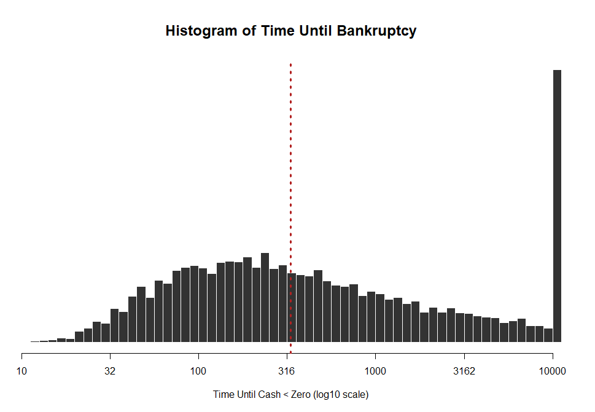

```{r setup, include=FALSE}
knitr::opts_chunk$set(echo = TRUE, message=F, warning=F, eval=T)
library( dplyr )
library( pander )
```


<br>

---

<br>


The random walk problem is a nice example of computational complexity in computer science because it is deceptively simple from a logic perspective, but it is non-trivial from a computational perspective because of edge cases.

Specifically, if it takes an average of 300 plays to go from a cash holding of 10 to zero, we might assume that it takes an average of 600 plays to go from 20 to zero. In fact, it will take a lot longer. This is not a linear problem.

Our simulation will work well in most cases here, but one out of every thousand plays our simulated person will go on a winning streak and amass 20, 30, 50, or 100 dollars before they start losing.

If we start from a high enough baseline value then it becomes extremely likely that for all practical purposes we NEVER hit zero. We can implement the code perfectly, but it would run for years and years on our computer before finding any meaningful values. This is what is meant by computational complexity - problems that do not scale linearly in run time.

Here is the random walk simulation data, for example:



It is not a normal distribution - it is extremely skewed right. Approximately 10% of the cases will run longer than 10000 periods, and theoretically any one of those could run for an infinite number of periods if they amassed enough of a cash reserve.

The code below includes a BREAK in the WHILE loop if the simulation is running too long. This protects you from one of the edge cases where one game runs for several hours. Note that is we are using the median as the measure of central tendency it will also not biased our results!

The code also includes some syntax for performance measurement - tracking how long it takes to run a simulation by logging the start time and end time.

These are some good things to pay attention to if you do more serious work with simulation.

```{r}
play_game <- function()
{
  cash <- 10  
  count <- 0 # set to zero

  while( cash > 0 )
  {
    cash <- cash +   
      sample( c(-1,0,1), size=1 )
    count <- count + 1

    # break from while loop
    # if winning streak too long 
    if( count > 10000 ){ break }
  }
  return( count )
}


start_time <- Sys.time()

######################
###                ###
###    SIM CODE    ###
###                ###
######################

results <- numeric(10000)
for( i in 1:10000 )
{
  results[i] <- play_game()
}

######################

end_time <- Sys.time()
end_time - start_time

summary( results )
```


## Follow-Up Questions

What is the typical length of play before hitting bankruptcy when we start from a cash reserve of 10? 

What is the typical length if we start from 20? 


```{r}
# generalize the start value 
play_game <- function( cash=10 )
{
  count <- 0 # set to zero

  while( cash > 0 )
  {
    cash <- cash +   
      sample( c(-1,0,1), size=1 )
    count <- count + 1

    # break from while loop
    # if winning streak too long 
    if( count > 100000 ){ break }
  }
  return( count )
}

play_game( cash=10 )
play_game( cash=20 )
```


### Run Time

How long does it take to run a simulation when the game starts from a cash reserve of 10? 

How long does it take to run the same simulation when cash reserves start from 20? 

Run 100 simulations to measure time, each with 100 loops over the game to measure run times. Report your results. 


```{r, eval=F}
# define collector

for( j in 1:100 )  # second loop for time
{
   
   start_time <- Sys.time()
   
   ######################
   ###                ###
   ###    SIM CODE    ###
   ###                ###
   ######################
   
   results <- numeric(100)
   for( i in 1:100 )
   {
     results[i] <- play_game()
   }
   
   ######################
   
   end_time <- Sys.time()
   total.time <- end_time - start_time

   # append results in your collector 
}
```


## Code for Histogram


```{r, eval=F}
par( mar=c(5,0,4,1) )
hist( log10(results), breaks=100, col="gray20", border="white", 
      axes=F, xlab="", ylab="", cex.main=1.5,
      main="Histogram of Time Until Bankruptcy" )

axis( side=1, at=seq(1,4,0.5), lab=round(10^seq(1,4,0.5),0) )
title( xlab="Time Until Cash < Zero (log10 scale)" )

abline( v=median(log10(results)), col="firebrick", lwd=3, lty=3 )

```

<br>

-----

<br>


<br>
<br>

<style>
blockquote {
    padding: 11px 22px;
    margin: 0 0 22px;
    font-size: 18px;
    border-left: 5px solid lightgray;
}

</style>

