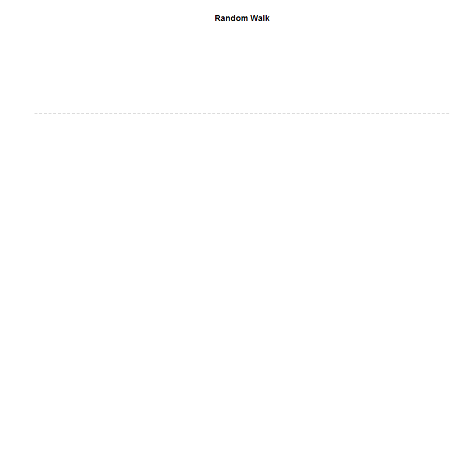
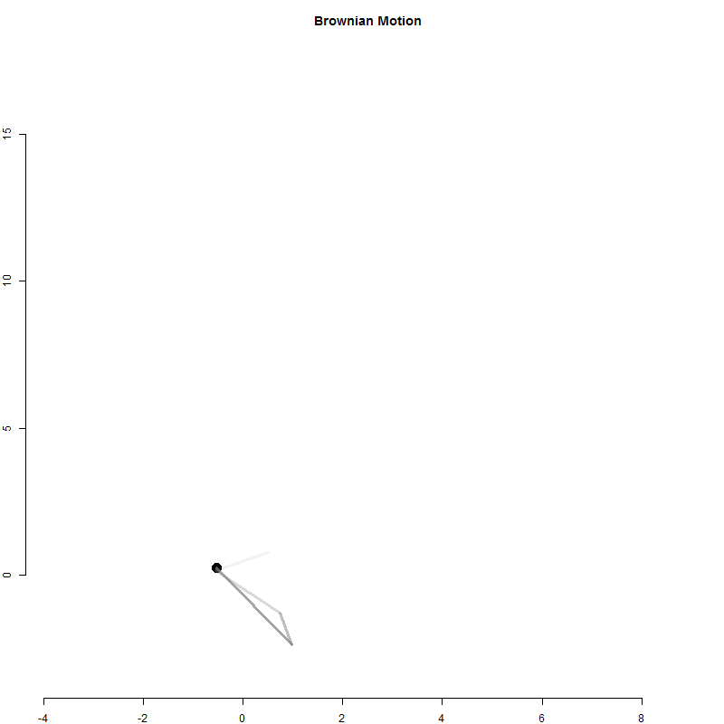

```{r setup, include=FALSE}
knitr::opts_chunk$set(echo = TRUE, message=F, warning=F, eval=T)
library( dplyr )
library( pander )
```


<br>

---

<br>

## The Random Walk

How can you make interesting animations in R?

We covered a very basic animation - a random walk - in the lecture notes.



Start game with $10 in cash and see how long you last. At each step you flip a coin and win a dollar, lose a dollar, or stay the same. How long does the average player survive before going bankrupt?

Since we are playing the game until a specific condition is met we will use a while loop:

```{r}
cash <- 10  
results <- NULL
count <- 0  

while( cash > 0 )
{
  # update cash holdings after win / loss
  cash <- cash +   
    sample( c(-1,0,1), size=1 )  
  # how many periods have we played?
  count <- count + 1  
}

count  # will report total number of plays before bankruptcy

# how would you incorporate a collector vector into the sim? 
```


## Brownian Motion 

This is a one-dimensional outcome tracked over time. Physicists have used a similar model to examine particle motion. It is called a Brownian Motion model. 



It is similar to the betting model above except for each time period the particle moves in two dimensions.

```{r, eval=T}
x <- 0  
y <- 0
for( i in 1:100 )
{
   # i + 1 represents the next period 
   # position in i+1 is a function of
   # current position plus random change
   x[i+1] <- x[i] + rnorm(1)
   y[i+1] <- y[i] + rnorm(1)
}

head( data.frame( x, y ) ) %>% pander()
```

The **rnorm()** function takes a random draw from a standard normal distribution, mean=0 and sd=1. Note we are equally as likely to move forward as backwards. 

What is the probability that our step will be larger than 1.96 in either direction (i.e. abs(x) )? 

```{r}
hist( rnorm(10000), breaks=100, col="gray20", border="white", 
      xlim=c(-3.5,3.5), main="Range and Density of Movements",
      xlab="Size and Direction of Movement Each Period",
      yaxt="n", ylab="" )
```


# Questions

Consider the two following problems.

## Q1

**How long does the typical person take to go bankrupt?** If you don’t want to do a complicated mathematical proof, you can create a simulation, play the game 10,000 times, then report the average period each game lasted.

What is the code to make this work?

## Q2 

Note the trailing tail in the Brownian Motion animation. How would you create that as part of an animation?


----------

Post your ideas or solutions on YellowDig:

Share your ideas about these problems with your classmates. Or share another animation that you found that uses loops.

<br>

-----

<br>


<br>
<br>

<style>
blockquote {
    padding: 11px 22px;
    margin: 0 0 22px;
    font-size: 18px;
    border-left: 5px solid lightgray;
}

</style>

