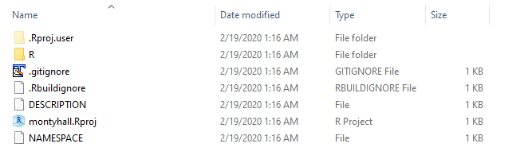

---
output:
  html_document:
    theme: united
    df_print: paged
    highlight: tango
    smart: false
    toc: yes
    toc_float: yes
    include:
      after_body: footer.html
editor_options: 
  chunk_output_type: console
---


```{r setup, include=FALSE}
knitr::opts_chunk$set(echo = TRUE)

# title: Creating an R Package
#    css: lab-instructions.css
#    include:
#      after_body: footer.html
```


# Creating an R Package

This tutorial will take you through the steps of creating a new package in R. 

There are five primary tasks: 

1. Create a package skeleton (set of empty files and folders). 
2. Add your R code to the skeleton directory. 
3. Create documentation for your package (similar to knitting RMD files). 
4. Install your new package on your computer and test it out. 
5. Upload the package to GitHub. 


**It is recommended to complete this lab in a regular R console, NOT in R Studio.** You can do it using RMD docs as well, but some of the steps will be different and it complicates things. 

The five steps are explained below, but the entire script you will need will look something like this: 


```{r, eval=F}
# set your working directory
# if you don't want to create
# the package in your default 
# working directory

getwd()   # default directory, usually my documents 
library(devtools)

# step 1
usethis::create_package( "montyhall" )

# step 2 move R script to montyhall/R folder
# after completing documentation fields 

# step 3
setwd( "montyhall" )
devtools::document()

# step 4
setwd( ".." )
devtools::install( "montyhall" )
library( montyhall )
create_game()

# step 5: close R and re-open new console
devtools::install_github( "yourGitHubName/montyhall" )
```


The examples below will walk you through the steps. You will also need to download the Monty Hall Problem functions that we completed during Labs 01 and 02 from the link below. This script contains some roxygen text to get you started with the process of documentation. 

[Download R Script](https://www.dropbox.com/s/u8k1co2bb7eldzj/monty-hall-problem.R?dl=1)

Note that you will update this script and place it in the montyhall/R folder after you complete Step 01 and the package skeleton has been created (the working directories for your package are built). 

The package code has been provided for you. You just need to complete the documentation and develop the test code for each function (you can adapt these from the unit testing examples in the labs). You place the **montyhall.R** script directly in the folder. You should not be using RMD files in this assignment. 


## Install Development Packages

```{r, eval=F}
install.packages(c("devtools", "roxygen2","usethis","testthat","knitr"))
# if devtools is not working try
# devtools::build_github_devtools() 
```

You can check that you have everything installed and working by running the following code:

```{r, eval=F}
library(devtools)
has_devel()
```

```{r, echo=F}
devtools::has_devel()
```


## Build a Package Skeleton

```{r, eval=F}
# devtools::create_package() has been deprecated
# set your directory
# setwd()
usethis::create_package( "montyhall" )
```


What you should see:


```{r, eval=F}
# > usethis::create_package( "montyhall" )
# ✔ Creating 'montyhall/'
# ✔ Setting active project to 'C:/Users/jdlecy/Documents/montyhall'
# ✔ Creating 'R/'
# ✔ Writing 'DESCRIPTION'
# Package: montyhall
# Title: What the Package Does (One Line, Title Case)
# Version: 0.0.0.9000
# Authors@R (parsed):
#     * First Last <first.last@example.com> [aut, cre] (<https://orcid.org/YOUR-ORCID-ID>)
# Description: What the package does (one paragraph).
# License: What license it uses
# Encoding: UTF-8
# LazyData: true
# ✔ Writing 'NAMESPACE'
# ✔ Writing 'montyhall.Rproj'
# ✔ Adding '.Rproj.user' to '.gitignore'
# ✔ Adding '^montyhall\\.Rproj$', '^\\.Rproj\\.user$' to '.Rbuildignore'
# ✔ Opening 'montyhall/' in new RStudio session
# ✔ Setting active project to '<no active project>'
```


You will now have a directory in your current folder called **montyhall**. This will contain the files you need for your package. 



*Note, some of these files like gitignore are from GitHub - they will appear after completing Step 05. Files may vary by operating system, but you should at the very least have the R folder, a DESCRIPTION file, and a NAMESPACE file.

## Document Your Functions

Add your roxygen comments to your R scripts:

```{r, eval=F}
#' @title
#' Sum of vector elements.
#'
#' @description
#' `sum(x)` returns the sum of all the values present in its arguments.
#'
#' @details
#' This is a generic function: methods can be defined for it directly
#' or via the [Summary] group generic. For this to work properly,
#' the arguments `...` should be unnamed, and dispatch is on the
#' first argument.
#'
#' @param x Numeric, complex, or logical vectors.
#' @param na.rm A logical scalar. Should missing values (including `NaN`)
#'   be removed?
#' @return If all inputs are integer and logical, then the output
#'   will be an integer. Otherwise it will be a length-one numeric or
#'   complex vector.
#'
#'   Zero-length vectors have sum 0 by definition. See
#'   <http://en.wikipedia.org/wiki/Empty_sum> for more details.
#'
#' @examples
#' sum(1:10)
#' sum(1:5, 6:10)
#' sum(F, F, F, T, T)
#'
#' sum(.Machine$integer.max, 1L)
#' sum(.Machine$integer.max, 1)
#'
#' \dontrun{
#' sum("a")
#' }
sum <- function(..., na.rm = TRUE) {}
```

Note that good documentation describes all of the arguments needed by the function, including the required data types of each object. And clearly describe what will be returned when the function runs (type of object, what it contains). 

Place your documented R scripts into the "R" folder in your package directory, then try:

```{r, eval=F}
setwd( "montyhall" )
devtools::document()
```

You should see: 

```{r, eval=F}
# Updating montyhall documentation
# Updating roxygen version in C:\Users\jdlecy\Documents\montyhall/DESCRIPTION
# Writing NAMESPACE
# Loading montyhall
# Writing create_game.Rd
```

You will see some errors as well if you have not yet finished documenting your functions. Ignore them for now. 

_**Depending upon your OS and your R devtools version you may be required to complete ALL documentation before preceding to the next steps. At the very least each function should have a title.**_

You will now have a new folder in your *montyhall* directory called "man", short for "manuals". The documentation files have an .Rd (R documentation) extension. 


## Install Your Package

Go up one level in your directory so you are outside of the package folder, but in the same folder where the package folder lives. Then run the command to install your new package. 

```{r, eval=F}
setwd( ".." )
devtools::install( "montyhall" )
```


If successful you will see messages like this: 

```{r, eval=F}
# Updating montyhall documentation
# Updating roxygen version in C:\Users\jdlecy\Documents\montyhall/DESCRIPTION
# Writing NAMESPACE
# Loading montyhall
# Writing create_game.Rd
# > getwd()
# [1] "C:/Users/jdlecy/Documents/montyhall"
# > setwd( ".." )
# > devtools::install( "montyhall" )
# √  checking for file 'C:\Users\jdlecy\Documents\montyhall/DESCRIPTION'
# -  preparing 'montyhall':
# √  checking DESCRIPTION meta-information ... 
# -  checking for LF line-endings in source and make files and shell scripts
# -  checking for empty or unneeded directories
# -  building 'montyhall_0.0.0.9000.tar.gz'
#    
# Running "C:/PROGRA~1/R/R-36~1.1/bin/x64/Rcmd.exe" INSTALL \
#   "C:\Users\jdlecy\AppData\Local\Temp\RtmpKetkbm/montyhall_0.0.0.9000.tar.gz" --install-tests 
# * installing to library 'C:/Users/jdlecy/Documents/R/win-library/3.6'
# * installing *source* package 'montyhall' ...
# ** using staged installation
# ** R
# ** byte-compile and prepare package for lazy loading
# ** help
# *** installing help indices
# 'montyhall'g help for package     finding HTML links ...
#  done
# -reate_game                             html  
# ** building package indices
# ** testing if installed package can be loaded from temporary location
# *** arch - i386
# *** arch - x64
# ** testing if installed package can be loaded from final location
# *** arch - i386
# *** arch - x64
# ** testing if installed package keeps a record of temporary installation path
# * DONE (montyhall)
```


## Test It 

In a new R session try:

```{r, echo=F}
create_game <- function()
{
    a.game <- sample( x=c("goat","goat","car"), size=3, replace=F )
    return( a.game )
} 
```

```{r, eval=F}
library( montyhall )
create_game()
```

```{r, echo=F}
# montyhall::create_game()
create_game()
```


## Check Help Files

You should be able to preview the help files that you created with your roxygen comments. 

```{r, eval=F}
help( "create_game" )
```


## Update Your Package Description 

Navigate to the main "montyhall" package folder on your computer and open the file called "DESCRIPTION" in a text editor (your computer will have a text editor like notebook). You will see something like this: 

```{r, eval=F}
Package: montyhall
Title: What the Package Does (One Line, Title Case)
Version: 0.0.0.9000
Authors@R: 
    person(given = "First",
           family = "Last",
           role = c("aut", "cre"),
           email = "first.last@example.com",
           comment = c(ORCID = "YOUR-ORCID-ID"))
Description: What the package does (one paragraph).
License: What license it uses
Encoding: UTF-8
LazyData: true
RoxygenNote: 6.1.1
```

Since we use dplyr in the package, we need to add another line to import and attach it. Add: 

```
Depends: 
   dplyr
```

Now complete the rest of the fields from "Title" to "Description". 


```{r, eval=F}
Package: montyhall
Title: What the Package Does (One Line, Title Case)
Version: 0.0.0.9000
Authors@R: 
    person(given = "First",
           family = "Last",
           role = c("aut", "cre"),
           email = "first.last@example.com",
           comment = c(ORCID = "YOUR-ORCID-ID"))
Description: What the package does (one paragraph).
Depends:
	dplyr
License: What license it uses
Encoding: UTF-8
LazyData: true
RoxygenNote: 6.1.1
```


# GitHub Hosting


You have a couple of options for sharing your new package with others. You could submit the package to the CRAN so that everyone in the world could install it in R using **install.packages("montyhall")**. 

We cannot use this option because (1) it's a homework assignment so we don't want to burden people with the task of reviewing a new package, (2) package names on the CRAN must be unique so everyone from the class would have to name it something different, and (3) the CRAN requires that the package passes some robustness checks to ensure everything is documented correctly and all of the code is running smoothly. 

A simpler option is to host your package on GitHub. Complete the following steps to upload your code to a new repository on GitHub:


1. Install the git client on your computer: [LINK](https://git-scm.com/downloads). 
2. Install GitHub Desktop application: [LINK](https://desktop.github.com/).
3. Open GitHub in a browser and navigate to your profile. 
4. Create a new repository titled "montyhall". Check the "Create with README" option.
5. Copy the URL for your new repository. 
6. Open GitHub desktop and select **File >> Clone Repository**. 
7. Select the desired location of the folder and paste the URL into the appropriate dialogue. 
8. Clone your GitHub repo. 
9. Open the new "montyhall" folder that was just created by GitHub on your machine.
10. Transfer all of the files **inside** of your old "montyhall" folder into the GitHub version. 
11. You should see the files appear in the GitHub Desktop app. In the "summary" field type something like "initial commit" and at the bottom left select "Commit to master". 
12. Now up at the top select "Push origin". 

This last step sends all of the files to GitHub. They sould appear on your repo page shortly. 

Now others should be able to install your package by typing: 

```{r, eval=F}
devtools::install_github( "yourGitHubName/montyhall" )
```


# Additional Resources

These are a few good resources for reference: 

[A nice tutorial by Fong Chun Chan](http://tinyheero.github.io/jekyll/update/2015/07/26/making-your-first-R-package.html)

[The official R Packages book by Hadley Wickham and Jenny Bryant](https://r-pkgs.org/index.html)

[Roxygen documentation on CRAN](https://cran.r-project.org/web/packages/roxygen2/vignettes/rd.html)


<br>
<br>
<hr>
<br>
<br>


