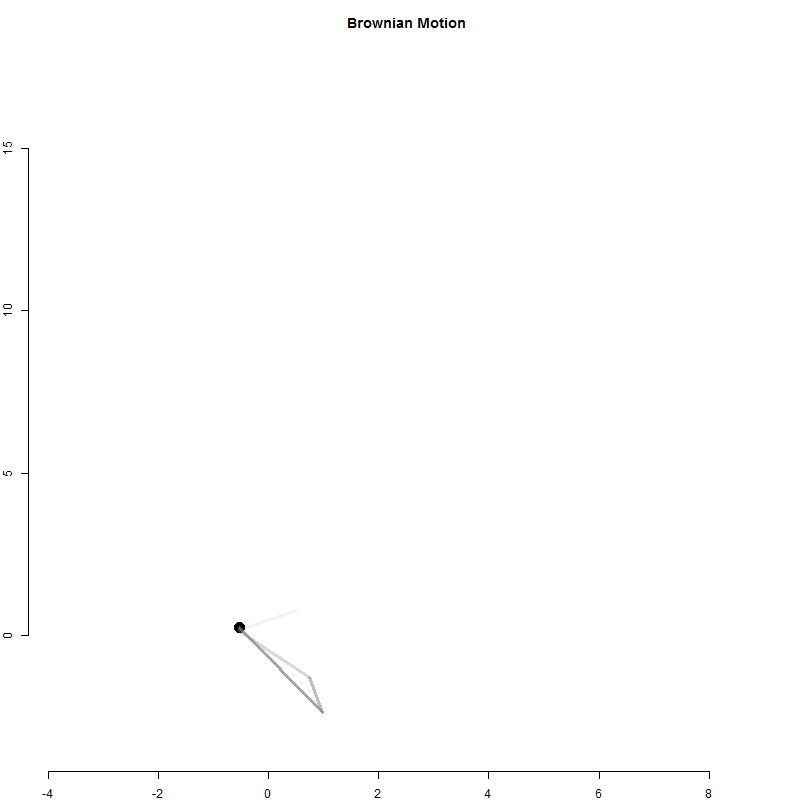

```{r, echo=F, warning=F, message=F }
library( dplyr )
library( pander )
library( knitr )
```


<br></br>
<br></br>
<br></br>


# Random Walk

A random walk is a mathematical exercise of taking 100 random steps, each moves the line higher or lower on the y-axis. It will look something like this:

```{r, fig.align='center'}

random.walk <- cumsum(rnorm(100))
  
plot( random.walk, type="l", col="darkred", axes=F, xlab="", ylab="", main="Random Walk" )
abline( h=0, lty=2, col="gray" )

```


Now how can we animate the process to make the concept easier to visualize?


```{r, eval=F, echo=F}

# dir.create("gifs")
setwd("gifs")

library( animation )

random.walk <- cumsum(rnorm(100))

min.y <- min(random.walk)
max.y <- max(random.walk)


saveGIF({
  
for( i in 1:100 )
{
  
  plot( random.walk[1:i], xlim=c(0,100), ylim=c(min.y,max.y),
        type="l", col="darkred", axes=F, xlab="", ylab="", main="Random Walk" )
  
  abline( h=0, lty=2, col="gray" )
  
}
  
  
}, 

movie.name = "random_walk.gif", 
interval = 0.15, nmax = 100, 
ani.width = 800,
ani.height = 800 )

```

<p align="center">

</p>


<br></br>
<br></br>
<br></br>

# Brownian Motion

What happens if we take a random walk along the x-axis and y-axis at the same time - if we are allowed to wander along a two-dimensional space. It will look something like a particle bouncing around inside a jar.

How would we create this animation? Here is some code to get you started:

```{r, eval=F}


x <- cumsum( rnorm(100) )
y <- cumsum( rnorm(100) )

max.x <- max(x)
min.x <- min(x)
max.y <- max(y)
min.y <- min(y)

par( ask=T )
par( mar=c(2,2,3,1) )

for( i in 5:100 )
{
  plot( x[i], y[i], pch=19, cex=2, xlim=c(min.x,max.x), ylim=c(min.y,max.y)  )
}


```


Now how do you make your animation look like this?

```{r, echo=F, eval=F}

library( animation )

setwd("gifs")

saveGIF({

x <- cumsum( rnorm(100) )
y <- cumsum( rnorm(100) )

max.x <- max(x)
min.x <- min(x)
max.y <- max(y)
min.y <- min(y)

# par( ask=T )
par( mar=c(2,2,3,1) )
for( i in 5:100 )
{
  plot( x[i], y[i], pch=19, cex=2, xlim=c(min.x,max.x), ylim=c(min.y,max.y), 
        bty="n", xlab="", ylab="n", main="Brownian Motion"  )
  segments( x0=x[i], x1=x[i-1], y0=y[i], y1=y[i-1], lwd=3, col=gray(0.5,0.7) )
  segments( x0=x[i-1], x1=x[i-2], y0=y[i-1], y1=y[i-2], lwd=3, col=gray(0.5,0.5) )
  segments( x0=x[i-2], x1=x[i-3], y0=y[i-2], y1=y[i-3], lwd=3, col=gray(0.5,0.3) )
  segments( x0=x[i-3], x1=x[i-4], y0=y[i-3], y1=y[i-4], lwd=3, col=gray(0.5,0.1) )
}


}, 

movie.name = "brownian_motion.gif", 
interval = 0.3, nmax = 100, 
ani.width = 800,
ani.height = 800 )


```


<p align="center">

</p>


<br></br>
<br></br>
<br></br>

# The animation Package

You will need to install the **animation** package in R to create gifs. You also need to install Image Magick, free software that turns images into animations.

If you install the program on a Windows machine, be sure to click the option "Install legacy components (convert.exe etc)" when it appears as a check box! Otherwise your **animation** package in R will not work.

The function you will use to create gif animations is called `saveGIF()`.

```{r, eval=F}

# create a directory for your images

dir.create("gifs")
setwd("gifs")

library( animation )


saveGIF({

  
  # the loop that creates your image files here


}, 

movie.name = "movie_name.gif",   # name of your gif
interval = 0.3,                  # controls the animation speed
ani.width = 800,                 # size of the gif in pixels
ani.height = 800 )               # size of the git in pixels
```


## Conway's Game of Life

From [Wikipedia](https://en.wikipedia.org/wiki/Conway%27s_Game_of_Life):

Conway was interested in a problem presented in the 1940s by mathematician John von Neumann, who attempted to find a hypothetical machine that could build copies of itself and succeeded when he found a mathematical model for such a machine with very complicated rules on a rectangular grid. The Game of Life emerged as Conway's successful attempt to drastically simplify von Neumann's ideas.

Ever since its publication, Conway's Game of Life has attracted much interest, because of the surprising ways in which the patterns can evolve. Life provides an example of emergence and self-organization. Scholars in various fields, such as computer science, physics, biology, biochemistry, economics, mathematics, philosophy, and generative sciences have made use of the way that complex patterns can emerge from the implementation of the game's simple rules[citation needed]. The game can also serve as a didactic analogy, used to convey the somewhat counterintuitive notion that "design" and "organization" can spontaneously emerge in the absence of a designer. For example, philosopher and cognitive scientist Daniel Dennett has used the analogue of Conway's Life "universe" extensively to illustrate the possible evolution of complex philosophical constructs, such as consciousness and free will, from the relatively simple set of deterministic physical laws, which might govern our universe.

The universe of the Game of Life is an infinite two-dimensional orthogonal grid of square cells, each of which is in one of two possible states, alive or dead, or "populated" or "unpopulated" (the difference may seem minor, except when viewing it as an early model of human/urban behaviour simulation or how one views a blank space on a grid). Every cell interacts with its eight neighbours, which are the cells that are horizontally, vertically, or diagonally adjacent. At each step in time, the following transitions occur:

1. Any live cell with fewer than two live neighbours dies, as if caused by underpopulation.
2. Any live cell with two or three live neighbours lives on to the next generation.
3. Any live cell with more than three live neighbours dies, as if by overpopulation.
4. Any dead cell with exactly three live neighbours becomes a live cell, as if by reproduction.

The initial pattern constitutes the seed of the system. The first generation is created by applying the above rules simultaneously to every cell in the seed—births and deaths occur simultaneously, and the discrete moment at which this happens is sometimes called a tick (in other words, each generation is a pure function of the preceding one). The rules continue to be applied repeatedly to create further generations.

It was generously translated into a compact R program by [Petrkeil](https://www.r-bloggers.com/fast-conways-game-of-life-in-r/).


```{r, eval=F}


## GAME SETUP

game.of.life <- function(side, steps, filename){
   
  # the sideXside matrix, filled up with binomially
  # distributed individuals
  X <- matrix(nrow=side, ncol=side)
  X[] <- rbinom(side^2,1,0.4)
   
  # array that stores all of the simulation steps
  # (so that it can be exported as a gif)
  storage <- array(0, c(side, side, steps))
 
  # the simulation                                             
  for (i in 1:steps)
  {
     # make the shifted copies of the original array
     allW = cbind( rep(0,side) , X[,-side] )
     allNW = rbind(rep(0,side),cbind(rep(0,side-1),X[-side,-side]))
     allN = rbind(rep(0,side),X[-side,])
     allNE = rbind(rep(0,side),cbind(X[-side,-1],rep(0,side-1)))
     allE = cbind(X[,-1],rep(0,side))
     allSE = rbind(cbind(X[-1,-1],rep(0,side-1)),rep(0,side))
     allS = rbind(X[-1,],rep(0,side))
     allSW = rbind(cbind(rep(0,side-1),X[-1,-side]),rep(0,side))
      
     # summation of the matrices
     X2 <- allW + allNW + allN + allNE + allE + allSE + allS + allSW
      
     # the rules of GoL are applied using logical subscripting
     X3 <- X
     X3[X==0 & X2==3] <- 1
     X3[X==1 & X2<2] <- 0
     X3[X==1 & X2>3] <- 0
     X <- X3
      
     image( X, col=c("white","steelblue") )

     # each simulation step is stored
     storage[,,i] <- X2
     # note that I am storing the array of Ni values -
     # - this is in order to make the animation prettier
   }
    
   storage <- storage/max(storage) # scaling the results
                                   # to a 0-1 scale
 
   # writing the results into an animated gif
   # write.gif(storage, filename, col="jet", delay=5)
}


## SAVE ANIMATION

library( animation )


# dir.create("gifs")
setwd("gifs")


saveGIF({

  par( mar=c(0,0,0,0) )
  game.of.life(side=50, steps=300 )

}, 

movie.name = "game_of_life.gif",   # name of your gif
interval = 0.1,                    # controls the animation speed
ani.width = 800,                   # size of the gif in pixels
ani.height = 800 )                 # size of the git in pixels


```


<br></br>
<br></br>
<br></br>


<p align="center">

</p>


<br></br>
<br></br>
<br></br>


# Regression Simulations


```{r, eval=F}


library( animation )
setwd("gifs")


createSample <- function( samp.size=10 )
{
	
	par( mar=c(5.1,5.1,4.1,1) )

      # CREATE A DATASET WITH 100 POINTS
      #
      # z = b0 + b1*x  where b0=800, b1=-2

      x <- seq( 20, 40, length.out=100 )
	z <- 800 - 10*x + rnorm(100, 0, 100)
	
	# DRAW A SAMPLE

      samp.id <- sample( 1:100, samp.size )
	
	x2 <- x[samp.id]
			
	z2 <- z[samp.id]	

	plot( x, z, xlim= c(40,20), ylim=c(200,800), 
            bty="n", pch=19, col=gray(0.5,0.5), cex=1.2,
	      main="Sampling Process", 
            xlab="Class Size", ylab="Test Performance",
            cex.main=2, cex.lab=2 )
	
     text( 40, 780, paste("SAMPLE SIZE OF", samp.size), pos=4, col="darkorange2", cex=1.5 )

     Sys.sleep( 3 )	


	for( i in 1:samp.size )
	{
	
	
	   for( j in 10:2 )
	   {   
	      
	        plot( x, z, xlim= c(40,20), ylim=c(200,800), 
                    bty="n", pch=19, col=gray(0.5,0.5), cex=1.2,
	              main="Sampling Process", cex.main=2, cex.lab=2,
                    xlab="Class Size", ylab="Test Performance" )

                    text( 40, 780, paste("SAMPLE SIZE OF", samp.size),
                          pos=4, col="darkorange2", cex=1.5 )	  

      
	      if( i > 1 )
	      {  points( x2[1:(i-1)], z2[1:(i-1)], pch=8, cex=2, col="darkorange2", lwd=2 )  }
	      
	      points( x2[i], z2[i], pch=8, cex=j, col="darkorange2", lwd=2 )
	         
	   }
	   
	   
	}
	
	

	for( m in 1:30 )
      {
	    plot( x, z, xlim= c(40,20), ylim=c(200,800), 
            bty="n", pch=19, col=gray(0.5,0.5), cex=1.2,
	      main="Sampling Process", cex.main=2, cex.lab=2,
            xlab="Class Size", ylab="Test Performance" )	        
			      
	    points( x2, z2, pch=8, cex=j, col="darkorange2", lwd=2 )
		
	    abline( a=800, b=-10, lwd=2 )
	
	    text( 28, 300, "True Slope", cex=2, pos=4 )

      }

	
      for( m in 1:50 )
      {

	    plot( x, z, xlim= c(40,20), ylim=c(200,800), 
            bty="n", pch=19, col=gray(0.5,0.5), cex=1.2,
	      main="Sampling Process", cex.main=2, cex.lab=2,
            xlab="Class Size", ylab="Test Performance" )	        
			      
	    points( x2, z2, pch=8, cex=j, col="darkorange2", lwd=2 )
		
	    abline( a=800, b=-10, lwd=2 )
	
	    text( 28, 300, "True Slope", cex=2, pos=4 )
	
	    r1 <- lm( z2 ~ x2 )
	
	    abline( a= r1$coefficients[1], b= r1$coefficients[2], col="darkorange2", lwd=2 )
	
	    text( 28, 250, "Best Guess", col="darkorange2", cex=2, pos=4 )

       }

}


# TEST

createSample( samp.size=10 )


# Generate a bunch of image files

png( "sample%03d.png", width=600, height=400 )
createSample( samp.size=10 )
createSample( samp.size=10 )
createSample( samp.size=10 )
dev.off()


## set conversion options

ani.options( interval=0, nmax = 2000 )

## matches all files with a wildcard *

im.convert( "sample*.png", output = "reg_sample_orange.gif" )


# Delete all temporary PNG files

dir()

unlink( "sample*.png")

      

```


<br></br>
<br></br>
<br></br>


<p align="center">

</p>


<br></br>
<br></br>
<br></br>


```{r, eval=F}


sampDistOfSlope <- function( num.trials=1000, samp.size=10, slowSim=F )
{

	slopes1 <- NULL

	x <- 1:100 
	z <- 400 + x + rnorm(100, 0, 100)

	for( i in 1:num.trials )
	{

		samp.id <-sample( x, samp.size )
		
		x2 <- x[samp.id]
		
		z2 <- z[samp.id]
		
		r1 <- lm( z2 ~ x2 )		
		
		slopes1[i] <- r1$coefficients[2]
		
		par( mfrow=c(1,2) )
		
		if( slowSim==T ) { par(ask=TRUE) }   # HAVE TO CLICK ON GRAPH FOR NEXT ONE
		
		if( slowSim==F ) { par(ask=FALSE) }

		
		plot( x, z, xlim= c(0,100), ylim=c(200, 750 ), xaxt="n", bty="n", pch=19, col=gray(0.5,0.5),
		      main="Repeated Samples", xlab="", ylab="Test Performance" )

            title( xlab="Class Size", line=2 )

		points( x2, z2, pch=8, cex=2, lwd=2, col="darkorange3" )

		abline( a=400, b=1 )

		abline( a= r1$coefficients[1], b= r1$coefficients[2], col="darkorange3", lwd=2 )
		
		hist( slopes1, col="darkorange3", border="lightgray",
                  xlim=c(-5, 6), ylim=c(0,num.trials/5), breaks=seq(-10,10,0.5), 
                  xlab="True Slope = 1", main="Sampling Distribution", yaxt="n", ylab="" )

	
	}
	
	return( slopes1 )

      
}


# USE:

sampDistOfSlope( num.trials=1000, samp.size=10, slowSim=F )


png( "samp_dist%03d.png", width=600, height=400 )

   sampDistOfSlope( num.trials=1000, samp.size=10, slowSim=F )

dev.off()


ani.options( interval=0, nmax = 2000 )

## matches all files with a wildcard *

im.convert( "samp_dist*.png", output = "sampling_dist_slope.gif" )


# Delete all temporary PNG files

unlink( "samp_dist*.png")


```


<br></br>
<br></br>
<br></br>

## SAMPLE SiZE = 10

<p align="center">

</p>


<br></br>
<br></br>
<br></br>

## SAMPLE SIZE = 50

<p align="center">

</p>


<br></br>
<br></br>
<br></br>


# Bed Bugs Outbreak Example

Let's start exploring the code violation data by looking at cases of Bed Bugs.


```{r}

data.url <- "https://raw.githubusercontent.com/lecy/code-orange/master/data/code%20violations.csv"
  
dat <- read.csv( data.url, stringsAsFactors=F)

dat <- dat[ , c("Complaint.Type","Violation.Date","lat","lon") ]

dat$Violation.Date <- as.Date( dat$Violation.Date, format="%m/%d/%Y" )

as.year <- format( dat$Violation.Date, format="%Y" )

in.order <- c("Jan","Feb","Mar","Apr","May","Jun","Jul","Aug","Sep","Oct","Nov","Dec")

as.month <- format( dat$Violation.Date, "%b" )

as.month <- factor( as.month, ordered=TRUE, levels=in.order )

dat$Month <- as.month

dat$Year <- as.year

bb <- dat[ dat$Complaint.Type == "Bed Bugs" , ]

```


Let's explore some trends over time:

```{r, fig.width=10, fig.height=4}

month.year <- format( bb$Violation.Date, "%b-%Y" )

plot( table( month.year ), lty=3, lwd=3, las=2, cex.axis=0.5, yaxt="n", ylab="" )


```

If we pay attention to the dates in the x-axis we can see that this did not quite work. Since we used the names of dates they are alphabetized, not ordered by time.

Let's try using the numerica representations of months:

```{r, fig.width=10, fig.height=4}

month.year <- format( bb$Violation.Date, "%m-%Y" )

plot( table( month.year ), lty=3, lwd=3, las=2, cex.axis=0.5, yaxt="n", ylab="" )

```


Whoops, still not quite there. How about putting the year first:

```{r, fig.width=10, fig.height=4}

year.month <- format( bb$Violation.Date, "%Y-%m" )

august.red <- c(rep("black",7),"red",rep("black",4))

plot( table( year.month ), lty=3, lwd=3, las=2, cex.axis=0.5, yaxt="n", ylab="", col=august.red )


```


Ok, that looks better. We can now see distinct annual trends in outbreaks. They tend to peak in August each year, except for 2013 when the outbreak peaked in July.


## Spatial Analysis

We will use several functions from the **ggmap** package in order to look at spatial patterns of code violations in Syracuse.

Let's start with the very useful `qmplot()` function which will automatically add a base map to a scatterplot  that uses latitude and longitude coordinates for the axes.

```{r, warning=F, message=F, fig.align='center', fig.width=10 }

library( ggmap )

qmplot( lon, lat, data = dat, maptype="toner-lite", color="red" )

```

We can see that we have some problems. Our data contains over 50,000 reports from Syracuse and addresses have been geocoded to produce the geo-coordinates. During some step of this process, most likely geocoding some of the addresses, errors have been generated. We do not actually have violations from Australia in the dataset, or anywhere outside of the city.

We need to filter our data by reasonable coordinates. Let's create a bounding box, drop points outside of it, and try again:

```{r, fig.show='hold', fig.width=3, fig.height=3, message=F, warning=F }

syr <- get_map( location="syracuse, ny", zoom=13, maptype = "toner-lite")

ggmap( syr ) 

syr.min.lat <-  42.96
syr.max.lat <-  43.12
syr.min.lon <- -76.25
syr.max.lon <- -76.05

dat <- dat[ dat$lat > syr.min.lat & dat$lat < syr.max.lat , ]
dat <- dat[ dat$lon > syr.min.lon & dat$lon < syr.max.lon , ]

qmplot( lon, lat, data = dat, maptype="toner-lite", color=I("red"), alpha=0.3 ) + theme(legend.position="none")

qmplot( lon, lat, data = dat, maptype="toner-lite", color=I("red"), geom="density2d" )


```

That looks a lot better.

Now let's clean up the violation types:

```{r}

sort( table( dat$Complaint.Type ), decreasing=T ) 


```


We can see that we have many violation types, but most only appear a few times in the data. Let's filter by the count of violation types:


```{r, warning=F, message=F, fig.width=9, fig.align='center'}

these <- names( sort( table( dat$Complaint.Type ), decreasing=T )[1:10] )

dat <- dat[ dat$Complaint.Type %in% these , ]

class( dat$Complaint.Type )
dat$Complaint.Type <- as.factor( dat$Complaint.Type )

levels( dat$Complaint.Type )

new.labels <- c("Bed Bugs","No Permit","General","Fire Hazard",
                "Trash","Infestation","Overgrown","Exterior Maintenance",
                "Interior Maintenance","Trash")

levels( dat$Complaint.Type ) <- new.labels

qmplot( lon, lat, data = dat, maptype = "toner-lite", 
        color=Complaint.Type) + facet_wrap(~ Complaint.Type) 


```


## Bed Bugs

Now let's try to make sense of seasonality and location patterns in the data by looking at reported cases of of Bed Bugs over time.


```{r, warning=F, message=F, fig.align='center', fig.width=8 }

bb <- dat[ dat$Complaint.Type == "Bed Bugs" , ]

qmplot( lon, lat, data = dat, maptype = "toner-lite", 
        color = I("orange"), alpha=0.3 )


```


We can use facets to split the data by months:

```{r, fig.align='center', fig.width=8 }

theme_set( theme_bw() )

ggplot( data=bb, aes( x=lon, y=lat ) ) + geom_point() + facet_wrap( ~ Month )

```


```{r, warning=F, message=F, fig.width=8, fig.align='center'}

qmplot( lon, lat, data = bb, maptype = "toner-lite", 
        color = I("orange") ) + facet_wrap(~ Month )
 
```


<br></br>
<br></br>
<br></br>


## Animating Bed Bug Outbreaks

Let's look at ways that we can make the data digestable.


Start simple, and use the par() argument ask=TRUE to create a manual animation of sorts. You will need to click on the graph to advance to the next image.

```

min.lat <- min( bb$lat )
max.lat <- max( bb$lat )
min.lon <- min( bb$lon )
max.lon <- max( bb$lon )


for( i in time.period )
{
   par( ask=TRUE )

   dat.sub <- bb[ year.month == i , ]

   plot( dat.sub$lon, dat.sub$lat, main=i,
         xlim=c(min.lon,max.lon), ylim=c(min.lat,max.lat),
         col=gray( 0.5, 0.5 ), pch=19, cex=3 )

}


```


Now you can start to add some complexity. It can be hard to identify patterns if there is no continuity between frames, so I would like each bed bug case to fade out by shrinking and becoming increasingly transparent. I need to layer several periods in time onto one graph, each with size representing time. The largest dots are the most recent cases, and they shrink for a couple of months until they disappear, leaving a trace of a case for at least a couple of months.


```


for( i in 1:(length(time.period)+4) )
{
   par( ask=TRUE )

   dat.sub.0 <- bb[ year.month == time.period[i] , ]

   dat.sub.2 <- bb[ year.month == time.period[i-2] , ]

   plot( dat.sub.0$lon, dat.sub.0$lat, main=time.period[i],
         xlim=c(min.lon,max.lon), ylim=c(min.lat,max.lat),
         col=gray( 0.5, 0.5 ), pch=19, cex=5 )

   if( i > 1 )
   { 
      dat.sub.1 <- bb[ year.month == time.period[i-1] , ]

      points( dat.sub.1$lon, dat.sub.1$lat, 
              col=gray( 0.5, 0.5 ), pch=19, cex=4 )
   }

   if( i > 2 )
   { 
      dat.sub.2 <- bb[ year.month == time.period[i-2] , ]

      points( dat.sub.2$lon, dat.sub.2$lat, 
              col=gray( 0.5, 0.5 ), pch=19, cex=3 )
   }

   if( i > 3 )
   { 
      dat.sub.3 <- bb[ year.month == time.period[i-3] , ]

      points( dat.sub.3$lon, dat.sub.3$lat, 
              col=gray( 0.5, 0.5 ), pch=19, cex=2 )
   }

   if( i > 4 )
   { 
      dat.sub.4 <- bb[ year.month == time.period[i-4] , ]

      points( dat.sub.4$lon, dat.sub.4$lat, 
              col=gray( 0.5, 0.5 ), pch=19, cex=1 )
   }


}


```

Now that we have developed the aesthetic, let's add the data to a map.

We will use the **animation** package to convert images to animated gifs. You will need to install Image Magick on your computer for the package to work.


```

library( animation )

syr <- get_map( location="syracuse", zoom=13, maptype = "toner-lite")


ggmap( syr, extent="device" ) + geom_point( aes(x=lon,y=lat), data=bb, col="orange", alpha=0.5, size=10 ) +
geom_text( aes( x=-76.115, y=43.015, label="August"), size=13, col="orange"  )


png("bedbugs%03d.png", width = 1000, height = 1000 )


for( i in 1:(length(time.period)+4) )
{

    dat.sub.0 <- bb[ year.month == time.period[i] , ]

    p <- ggmap( syr, extent="device" ) +
    geom_point( aes(x=lon,y=lat), data=dat.sub.0, 
                col="orange", alpha=0.5, size=20 ) +
    geom_text( aes( x=-76.115, y=43.015, label=time.period[i] ), 
               size=13, col="orange"  )

   if( i > 1 )
   { 
      dat.sub.1 <- bb[ year.month == time.period[i-1] , ]

      p <- p +  geom_point( aes(x=lon,y=lat), data=dat.sub.1, 
                col="orange", alpha=0.4, size=16 )
   }

   if( i > 2 )
   { 
      dat.sub.2 <- bb[ year.month == time.period[i-2] , ]

      p <- p +  geom_point( aes(x=lon,y=lat), data=dat.sub.2, 
                col="orange", alpha=0.3, size=12 )
   }

   if( i > 3 )
   { 
      dat.sub.3 <- bb[ year.month == time.period[i-3] , ]

      p <- p +  geom_point( aes(x=lon,y=lat), data=dat.sub.3, 
                col="orange", alpha=0.2, size=8 )
   }

   if( i > 4 )
   { 
      dat.sub.4 <- bb[ year.month == time.period[i-4] , ]

      p <- p +  geom_point( aes(x=lon,y=lat), data=dat.sub.4, 
                col="orange", alpha=0.1, size=4 )
   }

   print( p )


}

dev.off()

# ani.options( interval=1, ani.height=7, ani.width=7 )
im.convert( "bedbugs*.png", output = "bb-animation1.gif" )


```

