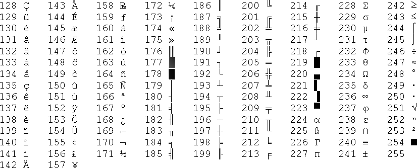

# Character Encoding 

When working with text as data you will often come across cases like this: 

```
# original text in document
"when we’re apart"
# what it looks like in R
"when we’re apart"

# replacement 
’ =   ’ 
```

To understand this issue you need to understand how word processors "encode" text. 

Your word will look like this in computer memory: 

```
[ 01000011 , 01000001 , 01010100 ]
```

A word processing program will know to present these values to humans as: 

```
CAT
```

When computers render raw digital files for human consumption they are translating each binary byte into strings by looking up their value in a table: 


```
# ASCII TABLE LOOKUP
01000011  = C
01000001  = A 
01010100  = T
```

<br>
<br>

## ASCII Tables 

Each character is stored as a separate code in an ASCII hash table, the universal table all computers use to map digits to text.  

> ASCII stands for the **American Standard Code for Information Interchange**. 

Each character is represented by several codes because different systems will use different representations. 

Your computer will use the BIN (8 bit or one byte binary version) to store a character in memory (a combination of eight 1's and 0's). HTML browsers will use the "HTML number": 


The ASCII table can store 256 unique characters (2^8=256). The first 128 characters in the ASCII table are universal - all computers use the same symbols for english-language documents. 


The second half of the table is called the **Extended ASCII** set. There are multiple versions for the second half of the table, depending upon which style you prefer or which language you are trying to encode. You need to know which version of the extended ASCII table you are working with otherwise you won't know which character a specific code represents. 



Similar to how R loads packages at the beginning of scripts, raw HTML files list a bunch of libraries and arguments at the top of each page so that the browser can use the correct character encoding rules: 

```
<!DOCTYPE html>
<html lang="en">
<head>
<meta charset="utf-8">
</head>
```

<br>
<br>

## Stylized Characters 

Modern word processors and browsers have started replacing regular quote marks with stylized open and closed quote marks for visual design purposes. 


MS Word and some browsers will do this in the background automatically without asking. When the text is copied and pasted or exported, then, it will carry these new characters forward. 

For example: 

```r
x <- c( "we’re", "we're" )
gsub( "we’re", "we are", x )
[1] "we are" "we're" 
gsub( "we're", "we are", x )
[1] "we’re"  "we are"
```

Spaces are actually one of the biggest issues - word processors and browsers have started using narrow spaces and wide spaces in addition to the regular space. They are different characters but are almost invisible to the naked eye, so can cause issues when trying to remove spaces. 

As a consequence, when you are loading text data you need to be conscious of whether these special characters have been introduced into your data. 

<br>
<br>

## ASCII Errors 

Whenever you see text like this it means that there was an extended ASCII character in your text file and the program you are currently working with either doesn't support the extended table characters or it did not know which version you were using, so it uses the raw encoding of the character instead of the character itself. 

```
"when we’re apart"
>>
"when we’re apart"
```

Here the stylized quote mark "’" was replaced with the code for that character "’".  

Note that the stylized quote is distinct from the regular quote: 

```
‘ vs ’ vs '
# left quote vs right quote vs regular quote
```

I'm not entirely sure when this happens, but if you search for the code "’" you will find a page like this: 

https://www.i18nqa.com/debug/utf8-debug.html


Which can help you work backwards to figure out what the character was supposed to be. 

<br>
<br>

## Pre-Processing Data in Text Analysis 

Typically these issues are reconciled at the data load and data cleaning step in text analysis. 

Sometimes you can simply delete anything from the extended ASCII table if it is not pertinent to your analysis. Other times you would basically search for all of these weird codes and replace them with the intended text. 

There are, of course, R packages for all of this. 

<br>
<br>
<hr>
<br>
<br>

