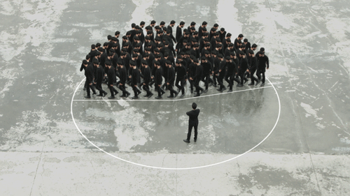
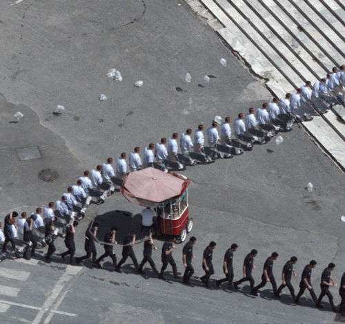
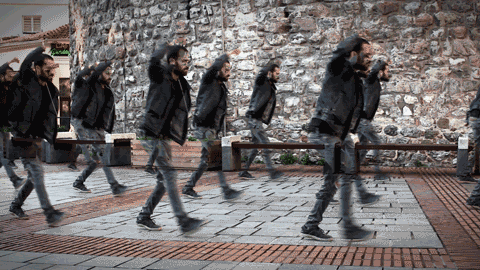
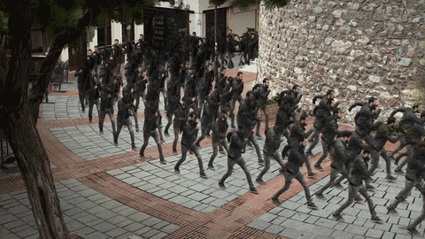

```{r xaringan-themer, include = FALSE, eval=T}
library(xaringanthemer)
mono_light(
  base_color = "#125972", ## picked to coordinate with rOpenSci logo
  code_highlight_color = "#c0e8f5",
  link_color = "#197b9e",
  header_font_google = google_font("Josefin Sans"),
  text_font_google   = google_font("Montserrat", "300", "300i"),
  code_font_google   = google_font("Droid Mono")
)
```


```{r setup, echo = FALSE, message = FALSE, warning = FALSE}
knitr::opts_chunk$set(echo = TRUE, eval = TRUE, message = FALSE )

# `r icon::fa("link")`


# devtools::install_github("hadley/emo")
# devtools::install_github("ropenscilabs/icon")
# devtools::install_github("gadenbuie/xaringanthemer")

library( icon )      ## for FontAwesome icons (ozunconf17 project!)
library( emo )       ## for emoji, obvs (github.com/hadley/emo)
library( tidyverse ) ## for data wrangling
library( assertr )   ## for testing data
library( pander )

```


# Table of Contents

- #### [for loops](#for)
- #### [while loops](#while)
- #### [complex constructors](#complex)
- #### [lists](#lists)
- #### [lab-02](#lab-02)


---
  

# Control Structures

So far we have learned about:
  
* assignment operator: `<- `
* mathematical operators: `+ - * / ^`  
* logical operators: `== >= <= != & | %in%` 
* subset operator: `[]` 
* data wrangling function: select filter group_by arrange  

For the most part these allow us to manipulate data.


---

class: center, middle 

# Control Structures 




Control structures are additional buildings blocks 
<br>necessary for effective data programming. 


---

# Control Structures Allow Us To:

<br>

.pull-left[


**if-else:**  
Only run code if conditions are met:  
 
 
**while loop:**  
Run code while a condition is met:  

**for loop:**  
Run code a certain number of times:  

]


.pull-right[

```{r, eval=F}
if( x > 0 )
{ return( log(x) ) } else
{ print( "log not defined" ) }
```

```{r, eval=F}
while( pig.weight < 300lbs )
{ pig.weight <- feed( pig ) }
sell( pig )
```

```{r, eval=F}
for( i in 5:1 )
{ print( i ) } # countdown
print( "Happy New Year!" )
```

]


---

class: center, middle 

# When Do We Use Control Structures? 



**If-else** statements are used when <br>
we only want the code to run when a <br>
particular condition is met. 


---

class: center, middle 

# When Do We Use Control Structures? 



**Loops** are used when we want to <br>
repeat the same operation <br>
over and over and over. 


---

class: center, middle 

## Loops are powerful because 


.pull-left[ 




]

.pull-right[


]

Unlike humans, the computer does not get tired, so we can scale repetitive tasks. 


---


# Anatomy of a for() Loop

.left-column[

### No loop

$2^1=2$

$2^2=4$

$2^3=8$

$2^4=16$

$2^5=32$

<br>

```{r, echo=F}
results <- NULL
results[1] <- 2^1 
results[2] <- 2^2 
results[3] <- 2^3 
results[4] <- 2^4 
results[5] <- 2^5 
```


]


.right-column[ 

```{r}
results <- NULL
results[1] <- 2^1 
results[2] <- 2^2 
results[3] <- 2^3 
results[4] <- 2^4 
results[5] <- 2^5
```

```{r, echo=F }
data.frame( results=results )
```


]


---

name: for


# Anatomy of a for() Loop

.left-column[

### First loop

$i=1$

$2^1=2$

<br>

```{r, echo=F}
results <- NULL
for( i in 1:5 )
{
  results[i] <- 2^i   
}
```

]


.right-column[ 

```{r}
results <- NULL
for( i in 1:5 )
{
  results[i] <- 2^i   
}
```


```{r, echo=F, highlight.output=2 }
data.frame( results=results )
```

]


---

# Anatomy of a for() Loop

.left-column[

### Second loop

$i=2$

$2^2=4$

<br>


]


.right-column[ 

```{r}
results <- NULL
for( i in 1:5 )
{
  results[i] <- 2^i   
}
```

```{r, echo=F, highlight.output=3 }
data.frame( results=results )
```

]


---


# Anatomy of a for() Loop

.left-column[

### Third loop

$i=3$

$2^3=8$

<br>


]


.right-column[ 

```{r}
results <- NULL
for( i in 1:5 )
{
  results[i] <- 2^i   
}
```

```{r, echo=F, highlight.output=4 }
data.frame( results=results )
```

]


---


# Anatomy of a for() Loop

.pull-left[ 

## This is your iterator

You loop **over** vectors.

The loop will visit every element of the vector once. 

]

.pull-right[

```{r}
results <- NULL 
iterator.vec <- 1:5  #<<
for( i in iterator.vec )  #<<
{
  results[i] <- 2^i   
}
```
]

The first time through **_i_** takes on the first value of your iterator vector. 

Each time the loop starts again, **_i_** takes on the next value in the vector.

_We can use any letter instead of **i**, but it is the most commonly used letter in loops._ 


---


# Anatomy of a for() Loop

.pull-left[ 

## No assignment of results  

Some loops do not save results. 

They will have no **collector vector**.

]

.pull-right[

```{r}
for( i in 1:5 )  
{
  x.squared <- i^2
  print( x.squared )   
}
```
]


---

# Anatomy of a for() Loop

.pull-left[ 

## This is your collector vector 

If you want to store results, you need an object that can hold them.

We will call this our **collector vector** because it gathers all of the results into one object for safe keeping.

]

.pull-right[

```{r}
results <- NULL   #<<
iterator.vec <- 1:5  
for( i in iterator.vec )  
{
  results[i] <- 2^i   
}
```
]


---


# Anatomy of a for() Loop

.pull-left[ 

## Assignment to the collector 

Note that the first example of assignment is problematic because each time we pass through the loop we will assign the new value to **results**, but we will over-write the value from the previous loop. 

We need to assign the new value to an empty slot **results[i]**. 

]

.pull-right[

```{r}
results <- NULL   
iterator.vec <- 1:5  
for( i in iterator.vec )  
{
  results <- 2^i   #<<
}
```

```{r}
results <- NULL   
iterator.vec <- 1:5  
for( i in iterator.vec )  
{
  results[i] <- 2^i   #<<
}
```
]


---


# Anatomy of a for() Loop


.pull-left[ 

## Assignment to the collector 

Note that in the previous example our iterator vector contained values 1 to 5.

In those cases collection is easy because we know that position **i** will be unique and sequential. 

What happens when the iterator does not start with 1 and go to N?  


]


.pull-right[

```{r}
results <- NULL   
iterator.vec <- c(3,5,7)  #<<
for( i in iterator.vec )  
{
  results[i] <- 2^i   
}
```

```{r, echo=F }
knitr::kable( data.frame( results=results ), format="html" )
```


]


---


# Anatomy of a for() Loop


.pull-left[ 

## Assignment to the collector 

Note that **i** starts at 3, so the first slot that a value is assigned to is the third position within our collector vector. 

Then **i** becomes 5, so the 5th position is the next slot used in **results[i]** to store the new value.  

If we skip positions during assignment, R will fill them with NAs. 

]


.pull-right[

```{r}
results <- NULL   
iterator.vec <- c(3,5,7)  #<<
for( i in iterator.vec )  
{
  results[i] <- 2^i   
}
```


```{r, echo=F }
knitr::kable( data.frame(  results=results ), format="html" )
```


]


---


# Anatomy of a for() Loop


.pull-left[ 

## Assignment to the collector 

There is a quick fix for this problem. We need to create a sequence that we can use for our iterator. 

We know that **length(x)** will tell us the total number of elements in x. 
]


.pull-right[

```{r}
results <- NULL   
iterator.vec <- c(3,5,7)  
for( i in iterator.vec )  
{
  results[i] <- 2^i       #<<
}
```

```{r}
results <- NULL   
x <- c(3,5,7)  
for( i in 1:length(x) )   
{
  results[i] <- 2^x[i]      #<<
}
```

]


So the sequence **1:length(x)** will be the correct dimension, start with 1, and end with length(x). 


---


# Anatomy of a for() Loop


.pull-left[ 

## Assignment to the collector 

Note that with the new iterator **i** is no longer taking on values of **x**. So we also need to start using the index **x[i]** to reference the current value of **x** in each loop. 
]


.pull-right[

```{r}
results <- NULL   
iterator.vec <- c(3,5,7)  
for( i in iterator.vec )  
{
  results[i] <- 2^i       #<<
}
```

```{r}
results <- NULL   
x <- c(3,5,7)  
for( i in 1:length(x) )   
{
  results[i] <- 2^x[i]     #<< 
}
```

]


<br>


---


# Anatomy of a for() Loop


.pull-left[ 

## Assignment to the collector 

We are now storing the new values sequentially in our collector vector. 


]


.pull-right[

```{r}
results <- NULL   
x <- c(3,5,7)  
for( i in 1:length(x) )   #<<
{
  results[i] <- 2^x[i]     #<< 
}
```


```{r, echo=F }
knitr::kable( data.frame(  i=1:3, x, results=results ), format="html" )
```

]


---

# Anatomy of a for() Loop


.pull-left[ 

## Looping over non-numeric vectors  

Our iterators do not have to be numeric. We can loop over any kind of vector.  


]


.pull-right[

```{r, eval=F}
results <- NULL   
lat <- c("lat1","lat2","lat3")   #<<
lon <- c("lon1","lon2","lon3")   #<<
for( i in 1:length(lat) )   
{
  # look up address at 
  # position lat[i] lon[i]
  results[i] <-                    #<<
    rev_geocode( lat[i], lon[i] )     #<< 
}
```


]

In this example we have a database of latitude and longitude coordinates for crimes.

We use a reverse geocoding function to find the street address of the locations. 


---

class: center, middle 

## Let's take a random walk


Random walks are used to model games of chance in mathematics. 


---

class: center, middle 

## Let's take a random walk


In each new time period the player flips a coin and can move either up or down on the chart. Up represents winning, down represents losing. 


---

class: center, middle 

## Let's take a random walk


The position on the graph represents cumulative wealth. If you start at zero and win three times in a row you will be at position three. Win two and lose one you are at position one (cumulatively you won 2 and but then lost half of that). 


---

class: center, middle 

## Let's take a random walk


Usually the player starts with a small dollar amount, and the model is used to study how long they can play the game before they go broke. Once they hit zero they can't bet anymore and have to go home. 


---

name: while


# Anatomy of a while() Loop


.pull-left[

```{r, fig.width=4, fig.height=4, echo=F}
cash <- 
c(9, 10, 10, 9, 8, 9, 8, 8, 7, 8, 9, 9, 10, 10, 10, 10, 10, 11, 
12, 13, 13, 12, 13, 14, 13, 13, 14, 14, 13, 12, 13, 13, 14, 13, 
12, 12, 12, 12, 11, 10, 11, 11, 11, 12, 12, 13, 13, 12, 11, 12, 
11, 11, 10, 9, 8, 7, 7, 8, 7, 6, 5, 6, 5, 4, 4, 4, 5, 4, 4, 3, 
4, 3, 2, 2, 1, 1, 2, 3, 3, 3, 3, 2, 2, 2, 1, 0, NA, NA, NA, NA, 
NA, NA, NA, NA, NA, NA, NA, NA, NA, NA)
plot( cash, bty="n", ylab="Cash", xlab="Time", type="l", col="darkred" )
```

]


.pull-right[ 

```{r}
cash <- 10  #<<
results <- NULL
count <- 1  
while( cash > 0 )
{
  cash <- cash +   #<<
    sample( c(-1,0,1), size=1 )  #<<
  results[count] <- cash  
  count <- count + 1  
}
```

]

Start game with $10 in cash and see how long you last. At each step you flip a coin and win a dollar, lose a dollar, or stay the same. What happened to the player here? 


---

# Anatomy of a while() Loop


.pull-left[

```{r, fig.width=4, fig.height=4, echo=F}
cash <- 
c(9, 10, 10, 9, 8, 9, 8, 8, 7, 8, 9, 9, 10, 10, 10, 10, 10, 11, 
12, 13, 13, 12, 13, 14, 13, 13, 14, 14, 13, 12, 13, 13, 14, 13, 
12, 12, 12, 12, 11, 10, 11, 11, 11, 12, 12, 13, 13, 12, 11, 12, 
11, 11, 10, 9, 8, 7, 7, 8, 7, 6, 5, 6, 5, 4, 4, 4, 5, 4, 4, 3, 
4, 3, 2, 2, 1, 1, 2, 3, 3, 3, 3, 2, 2, 2, 1, 0, NA, NA, NA, NA, 
NA, NA, NA, NA, NA, NA, NA, NA, NA, NA)
plot( cash, bty="n", ylab="Cash", xlab="Time", type="l", col="darkred" )
```

]


.pull-right[ 

```{r}
cash <- 10  
results <- NULL 
count <- 1  #<<
while( cash > 0 )
{
  cash <- cash +   
    sample( c(-1,0,1), size=1 )  
  results[count] <- cash   #<<
  count <- count + 1    #<<
}
```

]

Our **results** vector operates the same here, except you need to know what loop you are in. Here is where the **count** is important, because it keeps track of which loop we are currently in. 


---


name: complex 

# Complex Constructors


.pull-left[ 

## Looping over non-numeric vectors  

Our iterators do not have to be numeric. We can loop over any kind of vector.  


]


.pull-right[

```{r, eval=F}
results <- NULL   
lat <- c("lat1","lat2","lat3")   #<<
lon <- c("lon1","lon2","lon3")   #<<
for( i in 1:length(lat) )   
{
  # look up address at 
  # position lat[i] lon[i]
  results[i] <-                    #<<
    rev_geocode( lat[i], lon[i] )     #<< 
}
```

]

In this example we have a database of latitude and longitude coordinates for crimes.

We use a reverse geocoding function to find the street address of the locations. 


---


# Complex Constructors


.pull-left[ 

## Building Data Frames 

This example works fine in the istance where we get one text field back with the address. Since it's a single string value we can store it in the results vector. 

]


.pull-right[

```{r, eval=F}
results <- NULL   
lat <- c("lat1","lat2","lat3")   
lon <- c("lon1","lon2","lon3")   
for( i in 1:length(lat) )   
{
  # look up address at 
  # position lat[i] lon[i]
  results[i] <-                       #<< 
    rev_geocode( lat[i], lon[i] )     #<< 
}
```


]

What happens, however, when  when the function returns an address with street, city, and zip separate? 

Can we assign all of those values to a position in a results vector? 


---


# Complex Constructors


.pull-left[ 

## Building Data Frames 

We can't store multiple vectors or part of a data from inside of a vector. We need a more flexible data type. 


]


.pull-right[

```{r, eval=F}
results <- list()   #<<
lat <- c("lat1","lat2","lat3")   
lon <- c("lon1","lon2","lon3")   
for( i in 1:length(lat) )   
{
  # look up address at 
  # position lat[i] lon[i]
  results[[i]]                         #<< 
  <- rev_geocode( lat[i], lon[i] )     #<< 
}
dat <- dplyr::bind_rows( results )  #<<
```

]

A **list** should do the trick. After constructing it, you can convert it to a data frame with the last line. 

NOTE, **assignment to lists** uses a double-bracket`x[[ ]] <- f()`. 


---


name: lists


# Lists

Lists are the grab bag of data structures. 

Vectors are very sensitive to data type (when you add two types together you silently invoke implicit casting that can have serious effects on your data).

Matrices and data frames have to maintain their rectangular structure at all times, making it challenging sometimes to add new data. 

Lists allow you to combine different object types and tables with different dimensions easily because the list stores each object separately. It doesn't alter any of the data, but it also doesn't try to reconcile any of it (combining two vectors using c() invokes casting, combining two datasets requires row-congruence, column-congruence, or merges). 


---


#  Lists


You can think of the double-brackets as shelves that store each object  separately 

`x[[ ]] <- f()`. 

When you are ready to use it, you can take it off the shelf: 

`x[[1]] # return first object in list`


---

#  Lists

Lists are often used when we need to return a lot of information from a function, and the information comes in many object types or data dimensions

For example, after running a regression we get an **lm** or linear model object. This is actually just a list of all of the results from the regression:

.pull-left[
```{r}
x <- 1:10
y <- 2*x + rnorm(10)
m <- lm( y ~ x )
```
]
.pull-right[
```{r}
class( m )  #<<
mode( m )  #<<
```
]


---

# Lists

The **lm** object (class type) is stored using a list (object type or mode). 

Here are all of the separate objects stored in each slot of the list:

```{r}
names(m)
```


---

#  Lists

We can access the objects by position or by name:

```{r}
m$coefficients
m[[1]]
```


---

#  Lists

Each object retains its original type:

.pull-left[

```{r}
class( m$residuals )
head( m$residuals, 3 )
```

]

.pull-right[

```{r}
class( m$model )
head( m$model, 3 )
```

]

---

#  Lists

Or print the full list structure using **str()**:

```{r}
str( m )
```


---

class: center, middle  


# Lab 02

---

name: lab-02

# Monty Hall Problem


```{r, eval=F}
play_game <- function( )
{
 new.game <- create_game()
 door1 <- pick_door()
 opened.door <- open_goat_door( new.game, door1 )
 final.pick.stay <- change_door( stay=T, ... )
 final.pick.switch <- change_door( stay=F, ... )
 outcome.stay <- determine_outcome( final.pick.stay, ... )
 outcome.switch <- determine_outcome( final.pack.switch, ... )
 return( data.frame( stay=outcome.stay, switch=outcome.switch ) )  #<<
}
```

Using the steps from last week we can create a new function that combines all of the individual functions you wrote into one master **play_game()** function. Note that it will return a data frame, not a vector. 

How can we tell which strategy is efficient here? 


---

# Simulating Game Strategies 

```{r, eval=F}
play_game <- function( total.sims=10000 )
{
  
    results <- list()
    
    for( i in 1:total.sims )
    {
      results[[i]] <- play_game() 
    }
  
    dat <- dplyr::bind_rows( results )
    return( dat )
}
```

The beautiful part of simulation is we do not need to do a formal proof of anything. We can just play the game lots of times and see what happens - comparing the "stay" cases to the "switch" cases. 


---

# Instructions 

Using your code from last week (or the solutions if your code is not working properly) create a **play_game()** function that requires no inputs and returns two outcomes for each game played - what would have happened if you had stayed, and what would have happened if you had switched. 

Embed your new game function inside of a loop for 10,000 iterations and collect wins and losses for each strategy. 

Report your results as a table or an informative chart and discuss the results. What is the best strategy? 


