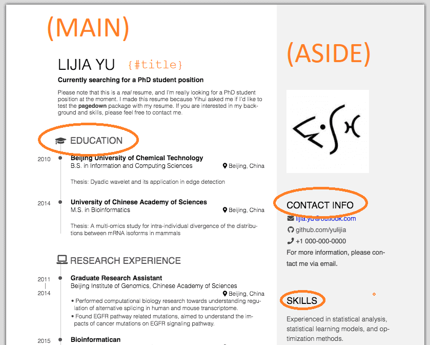

```{r setup, include=FALSE}
knitr::opts_chunk$set( message=F, warning=F, fig.width=10 )
```


This project demonstrates how you can leverage the R Markdown ecosystem and packages like **pagedown** to create report templates that can then be used to automate or batch-process reports. 

To demonstrate this, we will reverse-engineer a project to see how the pieces fit together to give insight into how you can design templates in the future. 

## The pagedown Package

The [**pagedown** package](https://pagedown.rbind.io) was created by Yihui Xie and Romain Lesur. Xie is a core member of the R Studio team and has been one of the lead developers of the R Markdown framework and thus the rich set of data-driven documents that make it easy to package your analysis in R. 

Pagedown provides a variety of templates that allow the user to create formal reports like academic papers or a PhD thesis, large layouts for posters, small layouts for business cards, and one template for professional resumes. 

Consider the following resume example to see this template in action:




Which is created from this RMD template (note how the sections correspond to highlights from the image):


```
---
title: "Someone's resume"
author: Your Name
output: pagedown::html_resume
---


Aside
====================================

Picture, etc.

Contact info
------------------------------------

Email, phone number, ...

Skills
------------------------------------

- One
- Two
- Three

Disclaimer
------------------------------------

A footer in the sidebar.


Main
====================================

Your Name {#title}
------------------------------------

Arbitrary content.

Education {data-icon=graduation-cap}
------------------------------------

### University One

Title

Location

Year

Arbitrary content

### University Two

...

::: aside
Arbitrary content.
:::


```

Similar to the work you have done with Flexdashboards, the majic here is that someone has done the hard work of creating an appealing template for R Markdown that is able to use simple formatting conventions from the document and translate them to structured page elements, thus making the job of creating new data-driven documents relatively easy in RMD. 


## Automating the Process

For this lab you will be creating your own professional resume, but doing it in a way that makes it easy code to maintain - by typing your data into an Excel Spreadsheet to keep track of positions. This is helpful for two reasons - first because it is easier to update the spreadsheet than it is to work with R Markdown files. And second, different employers ask for different resume style (academic CVs are long and contain all professional and research positions as well as things like publications, resumes are shorter and omit publications, and many employers ask for a one--page version that highlights key activities). If you enter all of the data directly into an RMD document and then want to change formats you need to cut and paste a lot of material, reformat some areas, change settings, etc. If you were smart about creating your spreadsheet you just categorize information as it is added, and you can genrate new versions of your resume by filtering out certain types of data. 

We will be reverse-engineering an example put together by [Nick Strayer](http://nickstrayer.me/cv/) since he has generously posted [his adaptation on GitHub](https://github.com/nstrayer/cv).

You will see that he very cleverly created code to automate the process, as well as produce both an [HTML version](http://nickstrayer.me/cv/resume.html) and a [PDF version](http://nickstrayer.me/cv/resume.pdf) of both resumes and CVs. 


### Packages

We will be working with the **pagedown** package to create the resume. This code also requires packages from the **tidyverse** and a string processing package called **glue**. 

```{r}
library( pagedown )
library( glue )
library( tidyverse )
library( pander )
```


### Data

Let's start by looking at the raw data. As he has described in his blog, he created a simple spreadsheet with a handful of fields to track his academic and professional activities. 

```{r}
URL <- "https://raw.githubusercontent.com/DS4PS/cv/master/positions.csv"
position_data <- read_csv( URL )
head( position_data ) %>% pander()
```

Each line in the spreadsheet contains basic information about activities: 

* section - the section of the resume 
* in_resume - whether to include the activity in the short resume version 
* title - title of the position 
* loc - locatino of the position 
* institution - employer
* start - year the position began 
* end - year the position ended 
* description_1 to description_3 - up to three short descriptions for each position 

In total there are approximately 40 entries currently in the following section categories: 

```{r}
table( position_data$section ) %>% knitr::kable( align="l" )
```


### Pagedown Resume Format

Pagedown has developed some simple conventions for adding content to a resume. Each section plus entry looks someting like this: 

```{r, eval=F}


Education {data-icon=graduation-cap}
------------------------------------

### University One

Title

Location

Year

Arbitrary content

### University Two

Title

Location

Year

Arbitrary content


Next Section
------------

  
```

For example, the first entry for Nick is: 

```{r, eval=F}
### PhD. Candidate, Biostatistics

Vanderbilt University

Nashville, TN

2020 - 2015

- Working on Bayesian network models & interactive visualization platforms
- University Graduate Fellow

```


### Helper Functions

In order to automate the resume creation process Nick has written a set of custom functions that allow his to quickly build content directly from his spreadsheet. 

To examine these functions they need to be sourced. They are available here: 

```{r}
source( "https://raw.githubusercontent.com/DS4PS/cv/master/parsing_functions.R" )
ls()
```


To preview a function you can either type the function name directly, or use fix("function_name") if you would like to alter it.

```{r, eval=F}
print_section
```


```
print_section <- function( position_data, section_id ){
  position_data %>% 
    filter(section == section_id) %>% 
    arrange(desc(end)) %>% 
    mutate(id = 1:n()) %>% 
    pivot_longer(
      starts_with('description'),
      names_to = 'description_num',
      values_to = 'description'
    ) %>% 
    filter(!is.na(description) | description_num == 'description_1') %>%
    group_by(id) %>% 
    mutate(
      descriptions = list(description),
      no_descriptions = is.na(first(description))
    ) %>% 
    ungroup() %>% 
    filter(description_num == 'description_1') %>% 
    mutate(
      timeline = ifelse(
        is.na(start) | start == end,
        end,
        glue('{end} - {start}')
      ),
      description_bullets = ifelse(
        no_descriptions,
        ' ',
        map_chr(descriptions, ~paste('-', ., collapse = '\n'))
      )
    ) %>% 
    strip_links_from_cols(c('title', 'description_bullets')) %>% 
    mutate_all(~ifelse(is.na(.), 'N/A', .)) %>% 
    glue_data(
      "### {title}",
      "\n\n",
      "{loc}",
      "\n\n",
      "{institution}",
      "\n\n",
      "{timeline}", 
      "\n\n",
      "{description_bullets}",
      "\n\n\n",
    )
}
```


Some of this code will not be familiar to you, but if you do a basic reading of the structure of the function you will see that it:

1. Filters entries by a section
2. Orders them by date (most recent first)
3. Combines start and end dates into a single string
4. Merges all description columns into a single list

These fields are then "glued" together using formatting for line breaks, and printed out as follows:

```{r, eval=F}
### PhD. Candidate, Biostatistics

Vanderbilt University

Nashville, TN

2020 - 2015

- Working on Bayesian network models & interactive visualization platforms
- University Graduate Fellow

```


For example:

```{r}
PDF_EXPORT <- FALSE
print_section( position_data, section_id="education" )
```

That's it! One function to move data from a table to an RMD template. This functions manages the majority of the content. 

### Language Skills Graph

You will notice that instead of just reporting computer languages that he knows, Nick is a graphic designer so he thought a visualization might better convey his level of skill across a set of languages. 

Similar to how we embedded tables in a GitHub page using data from YAML headers liquidtags, he wrote a function that converts a small table into an HTML barchart: 

```{r, eval=F}
build_skill_bars
```


```
function(skills, out_of = 5){
  bar_color <- "#969696"
  bar_background <- "#d9d9d9"
  skills %>% 
    mutate(width_percent = round(100*level/out_of)) %>% 
    glue_data(
      "<div class = 'skill-bar'",
      "style = \"background:linear-gradient(to right,",
      "{bar_color} {width_percent}%,",
      "{bar_background} {width_percent}% 100%)\" >",
      "{skill}",
      "</div>"
    )
}
```
The output looks like this:

```{r, echo=T}
skills <- tribble(
  ~skill,               ~level,
  "R",                  5,
  "Javascript (d3.js)", 4.5,
  "Python",             4,
  "Bash",               3.5,
  "SQL",                3,
  "C++",                3,
  "AWK",                3
)
build_skill_bars(skills)
```

```{r, results="asis", echo=F}
skills <- tribble(
  ~skill,               ~level,
  "R",                  5,
  "Javascript (d3.js)", 4.5,
  "Python",             4,
  "Bash",               3.5,
  "SQL",                3,
  "C++",                3,
  "AWK",                3
)
build_skill_bars(skills)
```


### Icons 

Icon codes for the section headers are found on [Font Awesome website](https://fontawesome.com/). 


```{r, eval=F}
Education {data-icon=graduation-cap}
------------------------------------
```


### HTML Page Template

If you are curious about the actual HTML template designed by Xie and Lesur you can see the file on the [**pagedown** GitHub site](https://github.com/rstudio/pagedown/blob/master/inst/resources/html/resume.html).

It is an HTML page that uses a lot of javasctipt to convert RMD elements to paged and formatted HTML elements. 

Note that if you or your organization needed a custom template the javascript might look intimidating, but web development is a fairly commoditized skill. If you know what you want the final report to look like, you can hire an HTML programmer to create a template. 

For example, on the e-contracting site Fiverr you can find [hire javasctipt developers](https://www.fiverr.com/gigs/javascript) for a few hundred dollars. Your job will be to manage the process, not try to do everything yourself! 

If you know how the pieces fit together, and identify what you need for each component, then you can build applications by having expertise in a key area and bringing in team members to fill gaps. You just need to be curious about how things work, and try to make sense of the process, not master all of the details. 


### RMD File

Finally, take a look at the RMD file used to generate the CV. Note a couple of things. 

Each section has a header, then auto-populated the data for the section using the **print_section()** function. 


````
Education {data-icon=graduation-cap data-concise=true}
--------------------------------------------------------------------------------

```{r}
print_section( position_data, 'education' )
```

````

Note that the global knit options are set so that code chunks are hidden during execution, and the new RMD text is addes "asis" (similar to Stargazer tables) so it embeds directly in the HTML documents insteading printing as R output. 

```{r, eval=F}
knitr::opts_chunk$set( results='asis', echo = FALSE )
```

Also note that it includes a single argument for changing the output option from an HTML page to a PDF, depending upon which format works best in context. 

```{r, eval=F}
# Set this to true to have links turned into footnotes at the end of the document
PDF_EXPORT <- FALSE
```


## Batch Processing RMD Files


So far you have knit your RMD files by pressing the knit button at the top of R Studio. 

Note, however, that you don't have to open an RMD file to knit it. You can convert RMD files to HTML using **knitr** and **pagedown** functions directly:

```{r, eval=F}
library( pagedown )
# setwd( "...directory where file lives..." )
html_resume( "index.Rmd", css="resume", template=pkg_resource("html", "resume.html") )
```

If you were a large agency that needed to track projects, so you created a project report survey tool using Google forms so each employee could submit updates on a regular basis, you could batch process thousands of reports by putting the knit function inside of a loop. 

Note that the current RMD file loads the necessary data internally:

```{r, eval=F}
position_data <- read_csv( 'positions.csv' )
```


You would remove that step from the template then load a separate spreadsheet (or filter from one large spreadsheet) for each project. Something like: 

```{r, eval=F}
# each project has a separate spreadsheet recording activities
project_files <- dir()
project.names <- gsub( ".csv", ".html", project_files )
                      
for( i in 1:length( project_files ) )
{
  position_data <- read_csv( project_files[i] )
  html_resume( "index.Rmd" )  # all use the same report template
  file.rename( from="index.html", to=project.names[i] )
}
```

You have now automated the generation of thousand of reports!


<br>

------

<br>


<style>

.skill-bar {
  color: white;
  padding: 0.1rem 0.25rem;
  margin-top: 3px;
  position: relative;
  width: 50%;
}

</style>
