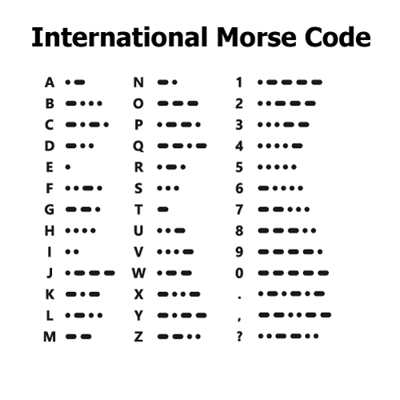
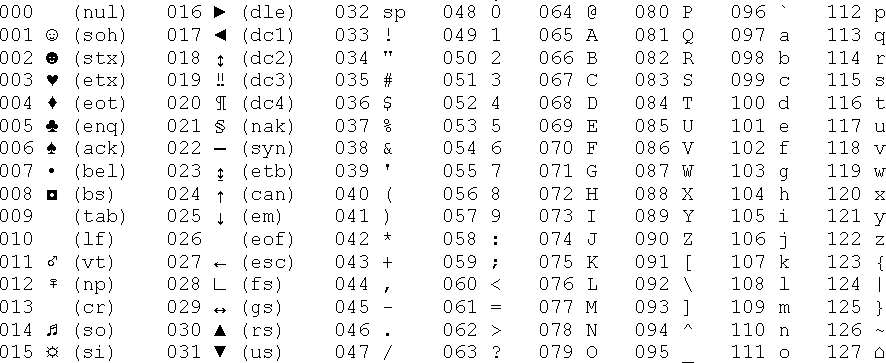

<div class = "uk-container uk-container-small">

-----------------------

* TOC
{:toc}

-----------------------

<br>
  
## String Processing & Regular Expressions

The core of all text analysis requires two sets of skills. Text is computer science is referred to as "strings", a reference to the fact that spoken languages mean nothing to computers so they just treat them as strings of letters (words) or strings of words (sentences). String processing refers to a set of functions and conventions that are used to manipulate text as data. If you think about the data steps for regular data, we clean combine, transform, and merge data inside of data frames. Similarly there are operations for important text datasets (often lots of documents full of words), cleaning them (removing words, fixing spelling errors), merging documents, etc. Core R contains many string processing functions, and there are lots of great packages. 

"Regular expression" are a set of functions used to aid in processing text by defining very precise ways to query a text database by looking for specific strings, or more often strings that match some specific pattern that has meaning. 
  
For example, even with all of the actual letters replaced by X here you can still tell me what each of these represent: 

* xxxxx@xxx.com   (email address) 
* www.xxxxxxxx.xxx   (web URL)
* @xxxxxxx  (social media handle) 

So regular expressions can be very useful for searching large databases for general classes of text, or alternatively for searching for generic text that occurs only in a very specific context (at the beginning or end of a word, in the middle of a phrase, etc.). 

Even if not conducting text analysis, you will use string processing functions + regular expressions extensively to clean your data. 

<a class="uk-button uk-button-default" href="../string-processing.html">CHAPTER</a>

<a class="uk-button uk-button-default" href="../string-processing-slides.pdf">SLIDES</a>

<br>
<hr>
<br>

## Character Encoding in ASCII  

<a class="uk-button uk-button-default" href="../ascii/">CHARACTER ENCODING</a>
  
You have learned that R stores factors as a numeric vector with a hash table to lookup the category labels: 
  
```r
f
[1] cat   dog   cat   mouse dog  
Levels: cat dog mouse

as.numeric(f)
[1] 1 2 1 3 2

# hash table 
# 1 = "cat"
# 2 = "dog"
# 3 = "mouse"
```  
  
A **hash table** is a table used to translate values from one representation to another. For example, the Morse Code is a famous system used to translate short and long beeps (sound) into written letters: 
  

  
Computers use a similar encoding system to represent text in word processors and browsers called the **ASCII Table**.

  
  
These notes present some basic background information on character encoding to help make sense of strange behaviors you might encounter while working with text as data in R.  
  
<br>
<hr>
<br>
  
## Helpful Reference Material

[One Page RegEx Cheat Sheet](https://github.com/DS4PS/cpp-527-spr-2020/raw/master/lectures/regular-expressions%20one-page-cheat-sheet.pdf) 

[RegEx cheat sheet in R](https://github.com/DS4PS/cpp-527-spr-2020/raw/master/lectures/RegExCheatsheetInR.pdf)


The **stringR** package is one of the most intuitive string processing packages in R. If you work extensively with text you will probably use this package. 

[stringR package](https://cran.r-project.org/web/packages/stringr/vignettes/stringr.html)
  
**For the labs in this class please use Core R string processing functions and refrain from using this package.** 
  
stringR is a useful wrapper package that provides slightly more intuitive syntax. For example, all stringR functions start with "str_" and they use literal verbs (str_replace) instead of abbreviations used in Core R functions (gsub = global substitution). 
  
The character vector (object X) is also the first argument in all stringR functions, where the order annoyingly changes in core R text functions:
  
```r
 # CORE R - position of X changes
grep(     "e", x )       # find and return subset match
gsub(     "a", "e", x )  # find and replace
strsplit(  x, " " )      # split string into parts

# VS stringR
str_subset(  x, "e" )          # find and return subset match
str_replace( x, "a", "e" )     # find and replace
str_split(   x, " " )          # split string into parts
``` 
  
But it is helpful to understand the Core R functions first because (1) they are slightly more flexible and (2) you will likely encounter them on discussion boards or in help files.  
  
Once you understand the string processing functions you can use stringR to write code faster, but try to avoid too much dependence on packages when you are first learning the code! 
  
  
```r
x <- c("why", "video", "cross", "extra", "deal", "authority")


# core R
grep( "e", x, value=TRUE )
> [1] "video"     "extra"     "deal"
# stringR
str_subset( x, "e" )
> [1] "video"     "extra"     "deal"

# core R
gsub( "[aeiou]", "?", x )
> [1] "why"       "v?deo"     "cr?ss"     "?xtra"     "d?al"      "?uthority"
# stringR
str_replace( x, "[aeiou]", "?" )
> [1] "why"       "v?deo"     "cr?ss"     "?xtra"     "d?al"      "?uthority"
```
  

  
<br>
<hr>
<br>
<br>

</div>
