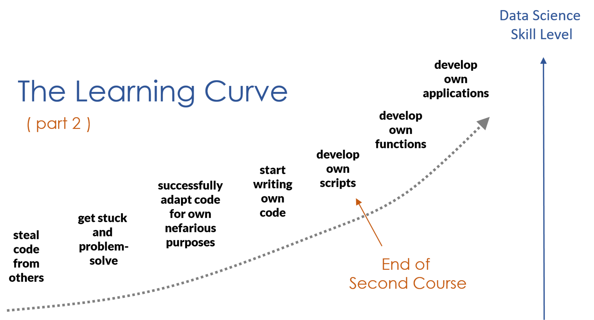

  
  
## Instructions

  
Becoming a good data programmer is a process similar to learning a musical instrument or a foreign language - the only way to get better is to practice.

When first starting out the goal is to simply get the code to run and produce results, not cryptic error messages. As you improve the goal is not just to get the code to work (although that is often a victory worth celebrating), but to be sure that the code is producing the result that you desire.

There are many nuances of the R language including functions that have different behaviors for different data types, hidden changes to the data like implicit casting or recycling vectors, and operators that are sensitive to context . These cases make it easy to produce nonsensical results with seemingly reasonable code , or even worse plausible but incorrect results (they are much harder to spot).

The best way to develop data programming acumen is to make mistakes, pause, and figure out what went wrong. Practice problems are designed as brain teasers that help you identify unexpected R behaviors so that you can get better at diagnosing bugs and develop a deeper understanding of how the R language operates.

Attempt the practice problems on your own. Share your insights with classmates. Learn from the diversity of approaches you see.

 

### RULES FOR PRACTICE PROBLEMS:

1. Share solutions to one or two of the questions each week by commenting on the appropriate pins. Responses to each question should be grouped on the same pin.
2. Please do NOT rush to be the first to answer all questions each week. Give your classmates a chance to participate. Everyone needs points.
3. Engage with solutions. Let your classmates know if their solution was clear or helpful. Ask questions for clarification. If you think a solution might be incorrect try to find an example that shows why.
4. Answer questions without looking for custom packages. Unless stated otherwise all of the problems can be solved using core R functions.
5. Format code and text appropriately and try to make your examples clear, concise, and reproducible when possible.
6. Create toy datasets or examples to test your solutions or demonstrate concepts. Clear examples are worth their weight in gold and are a best practice for developing robust code.

In addition to answers to practice problems, you are invited to share coding "learning moments" with your classmates - examples from your own work that highlight principles we cover this semester or demonstrate subtle errors that you encounter.

Feel free to post your own R brain teasers if you want to present your examples as questions instead of explanations.

### Yellowdig Points

You need to earn 100 points over the 7 weeks to earn full credit for participation in practice problems (15% of your grade). The points will be allocated as follows:

* 4 points for a new pin.  
* 3 points for a comment made to another pin.  
* 2 point if you receive a comment on your pin.  
* 1 point for liking another pin.  
* 5 points if you earn an instructor badge for an informative post.  
* max of 20 points can be earned each week. 

  
  
### Be Mindful of Progress  
  
New technical content will never be 100% clear when encountering it for the first time. 
  
Some material this semester will be review, some new. Make sure to remind yourself of how far you have come in a single semester. 
  
It typically takes ten years to hit a serious learning plateau, which is exciting because it means you are part of an interesting and dynamic field. 
  
But it means that you need to get comfortable learning new material now and on the job, and knowing when to attempt something alone and when to ask for help. 
  
Everyone gets stuck and makes mistakes. You just get stuck less often and make fewer mistakes over time. 
  
Trust the process and be mindful of your progress! 

  

  
 
  

  
  
  
 

 
 

