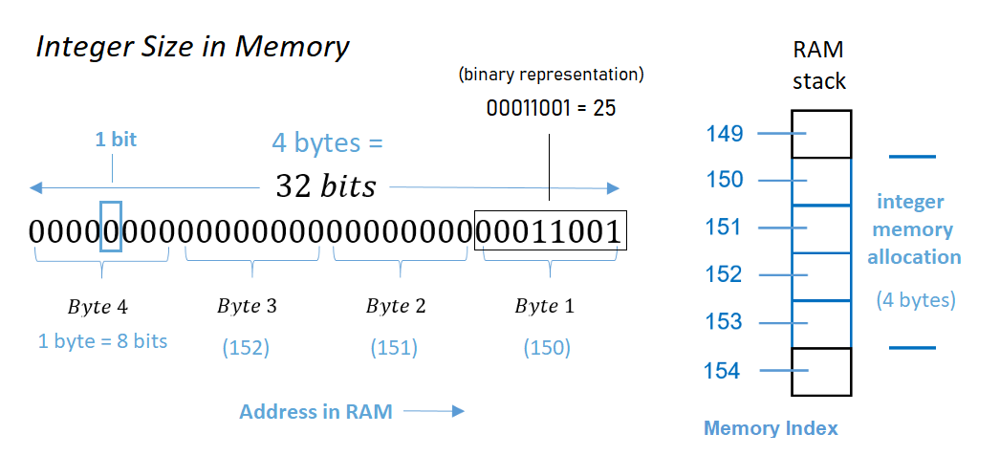

<div class = "uk-container uk-container-small">

<br>
<br>


# Week 01

-----------------------

* TOC
{:toc}

-----------------------

<br>
  
  
  
## Q1: IMPLICIT CASTING
  
When we combine two different data types we trigger an implicit cast. 
  
```r
x <- c(1,2,3)
y <- c("a","b","c")
c( x, y )
[1] "1" "2" "3" "a" "b" "c"
```
  
The challenge with casting is the loss of data or information. 
  
```r
x <- c(1,"a",2,"b")
x
[1] "1" "a" "2" "b"
as.numeric(x)
[1]  1 NA  2 NA
Warning message:
NAs introduced by coercion   
```

R tries to be clever by invoking a casting rule that minimizes data loss. For example, when we combine numeric and character vectors we will implicitly recast the object as a character vector. 

### Q1: Default Data Types
     
Consider the following cases. Explain why the defaults were selected in each case. 
     
```r
x.numeric <- 1:3
x.character <- LETTERS[1:3]
f <- factor( LETTERS[24:26] )
x
[1] 1 2 3
x.character
[1] "A" "B" "C"
f
[1] X Y Z
Levels: X Y Z

# CASE A
z <- c( x.numeric, x.character )
[1] "1" "2" "3" "A" "B" "C"
class( z )
[1] "character"

# CASE B
z <- c( x.character, f )
[1] "A" "B" "C" "1" "2" "3"
class( z )
[1] "character"

# CASE C  
z <- c( x.numeric, f )
[1] 1 2 3 1 2 3
class( z )
[1] "integer"
```
     
Which case is most likely to introduce errors in your analysis? Explain why and present an example. 
     
     
     


      
  
## Q2: FACTORS

### Q2-A: Ordering Levels

By default factors created in R will order levels (categories) alphabetically. 

In many cases levels have a meaningful order other than alphabetization. 

For example, days of the week, months of the year, etc.

How can you alter this factor so that it correctly orders the days of the week? 

```r
x <- c("MON","TUE","WED","THUR","FRI","SAT","SUN")
vec <- sample( x, 100, replace=TRUE )
f <- factor( vec )
table( f )

f
 FRI  MON  SAT  SUN THUR  TUE  WED 
  14   18   14    9   16   16   13
```

*Side note: in R the term __levels__ describes categories in a categorical variables (a factor).*

*In regression, we use the term __levels__ to describe numerical dosages of a treatment, such as milligrams of caffeine in a heart rate study.*

*In regression, the term __factor__ is also used synonymously with explanatory variable or __covariate__. For example, what other __factors__ might explain elevated heart rates in patients? Age could be one factor, race could be another factor. In this context __factor__ is a cause, not a categorical variable.*

*Make a mental note that __factor__ and __level__ are both precise technical terms that have different meanings in computer science and statistics.* 


### Q2-B: Empty Levels

How can we drop empty levels from a factor? 

```r
f2 <- f[ f %in% c("MON","TUE","WED","THUR","FRI") ]
table( f2 )

#  f2
#  FRI  MON  SAT  SUN THUR  TUE  WED 
#   16   15    0    0   14   13   12
```


### Q2-C: Counting Zeros

What about cases where counts of zeros are important? What if we wanted to note here days that events did not occur? 

Create a new factor that will report levels that do not occur in a sample. 

```r
x <- c("TUE","WED","FRI","SUN")
vec <- sample( x, 20, replace=TRUE )
f3 <- factor( vec )
table( f3 )

# HAVE
# f3
# FRI SUN TUE WED 
#   6   3   4   7

# WANT
# f3
# MON  TUE  WED THUR  FRI  SAT  SUN 
#   0    4    7    0    6    0    3
```


-----


## Q3: COMPARISON OF SETS

Recall the structure of IF STATEMENTS:

```r
if( logical statement )
{  code that only executes if TRUE }
```

It's important to note that the logical statement must return a SINGLE T/F value. If you use a logical vector as the argument in the IF condition then it will use the first T/F values in the vector and ignore the rest (which is problematic in many instances). 

The logical **EQUALS** operator **==** compares elements in two vectors in order. It will return the same number of T/F as length(x). 

If you want to test whether two vectors are the same use the **identical()** function, which always returns a single T/F value:

```r
x <- c("A","B","C")
y <- c("A","B","C")

x == y 
[1] TRUE TRUE TRUE
identical( x, y )
[1] TRUE

# incorrect
if( x == y )
{  some code  }

# correct
if( identical( x, y ) )
{  some code  }
```


### Q3-A: Ignore Order

Perhaps you want to run a chunk of code only IF two vectors contain the same elements, but order is irrelevant. 

Note that in most cases X and Y will represent vectors of observations. The order and position of vectors is extremely important. Changing the order or a vector will corrupt the data. 

```r
x <- c("tom","nancy","sara")
y <- c("male","female","female")
d <- data.frame( name=x, gender=y )
```

In this case X and Y represents **sets** of elements, so the positions are not important. 

Update this case to compare the two sets X and Y to see if they contain the same elements while ignoring order.

```r
x <- c("A","B","C")
y <- c("B","A","C")

identical( x, y )
[1] FALSE
```

### Q3-B: Ignore Vector Length

Similar to the case above, we want to compare these two sets to ensure they contain the same elements. We don't care about how many times each element occurs, just that the two sets are the same. 

How can we ignore the number of elements here? 

```r
x <- c("A","B","A","C")
y <- c("B","C","B","A","C")

identical( x, y )
[1] FALSE
```

### Q3-C: Data Types

This is an interesting case because the logical operator **==** will consider these vectors to be identical, but the **identical()** function will not.

```r
x <- c(1,2,3)
y <- c("1","2","3")

x == y 
[1] TRUE TRUE TRUE
identical( x, y )
[1] FALSE
```

The reason for this is that logical operators will implicitly cast data types in order to compare two objects that have different data types. You saw this last week:

```r
5 > 10
[1] FALSE

# implicitly casts both as character vectors
5 > "10"
[1] TRUE
```

How would you adapt the code here so it compares the two vectors and ignores the data type. 

```r
x <- c(1,2,3)
y <- c("1","2","3")
identical( x, y )
```

Does you solution also work with this example? 

```r
x <- c(01,02,03)
y <- c("01","02","03")
```


### Q3-D: Comparisons with Missing Values

Missing values are important in statistics and data analytics, but they pose some challenges for computer logic. 

Note the behavior of logical operations here:


```r
# missing info for both individuals
x <- c("A",NA,"C")
y <- c("A",NA,"C")

x == y 
[1] TRUE    NA  TRUE
identical( x, y )
[1] TRUE

# missing info for one individual
x <- c("A","B","C")
y <- c("A",NA,"C")

x == y 
[1] TRUE    NA  TRUE
identical( x, y )
[1] FALSE
```

Write a statement that compares two vectors while ignoring missing cases. 

Does your code also work with the following cases? 

```r
x <- c("A","A","B",NA,"C","C")
y <- c("A",NA,"B","B","C","C")
``` 

```r
x <- c("A","A","B","B","C","C")
y <- c("A",NA,"B",NA,"C","C")
```


-----


## Q4: APPROXIMATE MATCHES

In this example vectors represent sets of traits of pairs of individuals in a study. 

* race (white/minority) 
* gender (male/female)
* college degree? (college/highschool)

We want to identify people that are similar but not necessarily identical. 

Create a function that compares the two individuals and returns TRUE if they are the same on at least two traits, and false if they only match on one or zero traits. 


```r
compare_pairs <- function( x, y )
{
   # your code here
}


x1 <- c("white","female","college")
y1 <- c("white","female","college")
compare_pairs( x1, y1 )
# SHOULD BE TRUE

x2 <- c("minority","female","college")
y2 <- c("white","female","college")
compare_pairs( x2, y2 )
# SHOULD BE TRUE

x3 <- c("minority","female","college")
y3 <- c("white","male","college")
compare_pairs( x3, y3 )
# SHOULD BE FALSE

x4 <- c("minotity","female","college")
y4 <- c("white","male","high school")
compare_pairs( x4, y4 )
# SHOULD BE FALSE
```

  
  
  
  
  
  
  
## Q5: NUMERIC CASTING
     
A numeric vector is a generic category for vectors of numbers, but computers have different rules for storing integers versus decimals. The rules determine how much memory is allocated for each object. 

  
  
**Each element in an integer vector occupies 4 bytes of memory**. Each byte contains 8 bits. So each element in an integer vector requires 32 bits of memory.  
  
**The word bit is short for "binary digit", the smallest unit of storage in a computer and the fundamental building block of mathematics and code in computer science**. A bit is a single position in memory that can be in one of two states - either 1 (on) or 0 (off). All data in computers is encoded using bits. 

Try out binary number conversion to see an example of how it works: [Numeric to Binary Converter](https://www.rapidtables.com/convert/number/decimal-to-binary.html)  
  
How many different integer values can we represent with 4 bytes of memory then? 
  
--------  
  
*Each byte is considered to have 8 bits in this context. Since there are 4 bytes, that means 4 × 8 bits = 32 bits are available for storing a number.*  
  
*Therefore, each 4-byte portion of memory can handle 2³² = 4 294 967 296 representations. Typically, the ranges of integers supported are either:*  
  
* *0 .. 4 294 967 295 if you want only non-negative integer values and do not wish to “waste” a bit to indicate a sign (positive versus negative).*  
* *−2 147 483 648 .. 2 147 483 647, where one of the bits is used to indicate sign as opposed to allowing for greater positive values.*   

[explanation borrowed from](https://www.quora.com/How-many-numbers-can-you-represent-in-4-bytes)

------
  
Vectors of **decimal numbers are called doubles because the computer allocates 8 bytes or twice as much memory** for each element as allocated for elements in an integer vector. So more precise numbers are more "expensive" in computational terms. *Modern computers typically allocate more than 8 bytes per element for doubles and it varies by operating system.*

### Q5-A: Default Numeric Type

Based upon these examples, what are the rules R applies for numeric casting when combining integers and doubles? Does this rule optimize performance (smaller objects = faster computing time), or information integrity (preventing loss of precision)? 
  
```r
> x <- sample( 1:10, 100, replace=TRUE )
> x
  [1]  1  6  2  9  9  7  6  3  6 10  2  9  5  3 10
 [16]  2  7  5  3  3  1  6  1  9  9  3 10  2  6  8
 [31]  2  3  1  9 10  6 10  1  6  8  1 10  5  4  2
 [46]  1 10  8 10  3  8  7  4  7  5  1  9  2  9  6
 [61]  3  8  1  7  2  6  9  9  1  3  4  5  2  4  3
 [76]  6  5  7  4  6  7  4  2  9  1  6  3  3  6  2
 [91]  1  6  3  1  8  7  6  4  6  8
> typeof(x)
[1] "integer"
> object.size(x)
448 bytes
> 
> x <- as.double(x)
> x
  [1]  1  6  2  9  9  7  6  3  6 10  2  9  5  3 10
 [16]  2  7  5  3  3  1  6  1  9  9  3 10  2  6  8
 [31]  2  3  1  9 10  6 10  1  6  8  1 10  5  4  2
 [46]  1 10  8 10  3  8  7  4  7  5  1  9  2  9  6
 [61]  3  8  1  7  2  6  9  9  1  3  4  5  2  4  3
 [76]  6  5  7  4  6  7  4  2  9  1  6  3  3  6  2
 [91]  1  6  3  1  8  7  6  4  6  8
> typeof(x)
[1] "double"
> object.size(x)
848 bytes
> 
> 
> x <- sample( 1:10, 100, replace=TRUE )
> typeof(x)
[1] "integer"
> object.size(x)
448 bytes
> 
> z <- c( x, 1 )
> z
  [1] 10  8  5  5  6  7  5  1  5  7  3 10  2  9  5
 [16]  4  5  7  9  1  6  7 10  7 10  5  1  8  3  5
 [31]  2  4  5  4  2  9  1  1  7  4  3  5  4  9  7
 [46]  3  1  2  5  8  9  1  3  8  6  1  1  8  4  4
 [61]  6 10  6  6  8  6  6  3  3  7  1  1  9  9  5
 [76]  8 10  3 10  5  1  8  5  4 10  4  3  4  1  5
 [91]  2  4  7  4  2  4  6  9  4 10  1
> typeof(z)
[1] "double"
> object.size(z)
856 bytes
> 
> z <- c( x, 1.00 )
> z
  [1] 10  8  5  5  6  7  5  1  5  7  3 10  2  9  5
 [16]  4  5  7  9  1  6  7 10  7 10  5  1  8  3  5
 [31]  2  4  5  4  2  9  1  1  7  4  3  5  4  9  7
 [46]  3  1  2  5  8  9  1  3  8  6  1  1  8  4  4
 [61]  6 10  6  6  8  6  6  3  3  7  1  1  9  9  5
 [76]  8 10  3 10  5  1  8  5  4 10  4  3  4  1  5
 [91]  2  4  7  4  2  4  6  9  4 10  1
> typeof(z)
[1] "double"
> object.size(z)
856 bytes
> 
> 
> z <- c( x, 1.01 )
> z
  [1] 10.00  8.00  5.00  5.00  6.00  7.00  5.00
  [8]  1.00  5.00  7.00  3.00 10.00  2.00  9.00
 [15]  5.00  4.00  5.00  7.00  9.00  1.00  6.00
 [22]  7.00 10.00  7.00 10.00  5.00  1.00  8.00
 [29]  3.00  5.00  2.00  4.00  5.00  4.00  2.00
 [36]  9.00  1.00  1.00  7.00  4.00  3.00  5.00
 [43]  4.00  9.00  7.00  3.00  1.00  2.00  5.00
 [50]  8.00  9.00  1.00  3.00  8.00  6.00  1.00
 [57]  1.00  8.00  4.00  4.00  6.00 10.00  6.00
 [64]  6.00  8.00  6.00  6.00  3.00  3.00  7.00
 [71]  1.00  1.00  9.00  9.00  5.00  8.00 10.00
 [78]  3.00 10.00  5.00  1.00  8.00  5.00  4.00
 [85] 10.00  4.00  3.00  4.00  1.00  5.00  2.00
 [92]  4.00  7.00  4.00  2.00  4.00  6.00  9.00
 [99]  4.00 10.00  1.01
> typeof(z)
[1] "double"
> object.size(z)
856 bytes
```

*Note that the print function (which is called implicitly by typing the object name) will truncate zeros at the end of numbers up to the last meaningful digit. As a result, you cannot determine whether a numeric vector is an integer by printing it out because integers and doubles will often appear the same when printed. You need the **typeof()** function to check the data type for numeric vectors.*
  
  
  
### Q5-B: Memory Allocation and Precision
  
Since computers only allocate a certain amount of memory for numbers at some point they will need to truncate a number in order to store it in memory. 

Explain why the following might happen
  
```r
x <- 6.001
x
[1] 6.001
x <- 6.0000000000000000000000000000000001
x
[1] 6
 
6 == 6.001
[1] FALSE
6 == 6.0000000000000000000000000000000001
[1] TRUE
```

  
  
  
### Q5-C: Comparisons with Rounding Errors 

This is one of the most unexpected and somewhat shocking errors you can encounter in computer science: 

```r
x <- 0.5 - 0.3
y <- 0.3 - 0.1

x
[1] 0.2
y
[1] 0.2


x == y   
[1] FALSE    
# FALSE on most machines

identical( x, y )
[1] FALSE
```

To see what is happening here print the difference of the variables: 

```r
x - y
[1] 2.775558e-17
```

It turns out that numbers with decimals are hard to represent in computer memory, so very tiny rounding errors can be introduced in calculations. They are not noticed unless the numbers are compared at the smallest scale. 

```
# 1.051
# 1.052
1.1 equals 1.1 
1.05 equals 1.05
1.051  does NOT equal  1.052 
```

In the example above the variables X and Y are identical up until the 17th decimal point. 

The tiny difference was introduced by converting decimal numbers to their binary representation as a string of 0'a and 1's in ther computer's memory while doing the mathematical calculations behind the scenes. 

This tiny tiny rounding error will tyically **only** pose a problem in logical statements. And only if the conversion introduces a rounding error, which is typically not the case: 

```r
x <- 5 - 3
y <- 3 - 1
x == y
[1] TRUE

x <- 0.1 + 0.1
y <- 0.0 + 0.2
x 
[1] 0.2
y
[1] 0.2
x == y
[1] TRUE
```

The formal and robust solution is to use the **all.equal()** function when comparing numerical objects.  

*USE THIS APPROACH IN YOUR CODE.*

```r
x <- 0.5 - 0.3
y <- 0.3 - 0.1
all.equal( x, y )
[1] TRUE
```

Explain why these also work: 

```r
x <- 0.5 - 0.3
y <- 0.3 - 0.1

x2 <- round( x, 1 )
y2 <- round( y, 1 )

x2
[1] 0.2
y2
[1] 0.2

x2 == y2
[1] TRUE

x3 <- as.character( x )
y3 <- as.character( y )

x3
[1] "0.2"
y3
[1] "0.2"

x3 == y3
[1] TRUE
```

  
<br>
<br>
<br>
  
-----

<br>
  

## Q6: COUNTING SUBSTRINGS

**CHALLENGE QUESTION**
  
In all of the examples above we were comparing two things. 

```r
# is it a nine?
x <- c( 1, 9, 10, 19, 99, 09 )
x == 9 
[1] FALSE  TRUE FALSE FALSE FALSE  TRUE

```

Recall that logical statements can be used to count things. 

```r
# is it a nine?
x <- c( 1, 9, 10, 19, 99, 09 )
sum( x == 9 )
[1] 2
```


**Q6-A: How would you count all nine's in the vector?**

For example, 19 contains one nine, 99 contains two nines. 


**Q6-B: How would you count all of the elements of X that CONTAIN a nine?**

For example, 19 contains a nine. 

**Q6-C: Count all 17's in a vector X containing all integers from 1 to 2,000.**

```r
x <- 1:2000
```

How many times does "17" occur in the vector? 

For example, the number 117 contains a 17. The number 170 also contains a 17. 


  
<br>
<hr>
<br>

</div>
 
<style>
em {
    color: black;
} 
  
h1{
  font-size:calc(2em + 0.25vw) !important;
  margin-top:160px !important;
  margin-bottom:20px;
  } 
  
h2{
  font-size:calc(2em + 0.25vw) !important;
  font-weight:300;
  margin-top:80px !important;
  margin-bottom:20px;
  } 

h3{
  font-size:calc(1.4em + 0.25vw);
  font-weight:300;
  margin-top:40px !important;
  margin-bottom:10px;} 
   

ul a:hover {
  color: #337ab7;
  text-decoration: none;
  font-weight: normal;
} 

#markdown-toc ul {
  font-size:calc(0.85em + 0.25vw);
  line-height:1.2;
  font-weight: bold;
} 
#markdown-toc ul li {
  list-style-type: disc !important;
  font-size:calc(0.65em + 0.25vw);
  line-height:1.2;
  margin-left: 20px;
}  
#markdown-toc a {
  color: black;
  font-size:calc(0.65em + 0.25vw);
  line-height:1.2;
  font-weight: normal;
}  
#markdown-toc a:hover {
    color: black;
    text-decoration: none;
    font-weight: bold;
}

</style>
